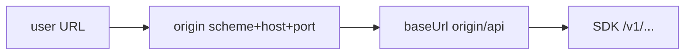

# US-002: Настроить клиент Firefly из сохранённых токена и URL

**История:** priority 2, `passes: false`. Ссылки на Figma нет (`designReference: []`).

**Вне скоупа:** экран логина (US-003), гард и вкладки (US-004), правки `src/api`, App/роутер/заглушка Budget. Инстанс Firefly в подпути (`https://nas.local/firefly`) не поддерживаем.

## Контекст

Сгенерированный клиент — синглтон в [`src/api/client.gen.ts`](src/api/client.gen.ts):

```ts
export const client = createClient(createConfig<ClientOptions2>({
  baseUrl: 'https://demo.firefly-iii.org/api',
}));
```

SDK ходит на `baseUrl + /v1/...` (например `/v1/about`). У `client` есть `setConfig` / `getConfig`; заголовок `Authorization` мержится через `mergeHeaders`. Файлы в `src/api` не трогаем.

FR-1: человек даёт хост инстанса (с путём или без). Приложение обрезает ввод до origin (схема, хост, порт) и ставит `baseUrl` = `{origin}/api`. Сегмент `/v1` в `baseUrl` не кладём — его клеит SDK. Токен и URL живут в `localStorage`.

Пример: `https://firefly.example.com/api/v1/` → origin `https://firefly.example.com` → `baseUrl` `https://firefly.example.com/api` → запросы `…/api/v1/...`.



## Шаги

### 1. Нормализация URL

Добавить [`src/helpers/normalizeBackendUrl.ts`](src/helpers/normalizeBackendUrl.ts):

1. `trim`
2. Нет схемы — префикс `https://`
3. `new URL(...).origin`
4. Вернуть `${origin}/api`

Невалидный URL: пусть `new URL` бросает. Экран логина (US-003) покажет это как ошибку backend URL.

Примеры: `https://x.com` → `https://x.com/api`; `https://x.com/api/v1/` → `https://x.com/api`; `https://x.com/firefly/api` → `https://x.com/api`; `http://127.0.0.1:8080/foo` → `http://127.0.0.1:8080/api`; `firefly.example.com` → `https://firefly.example.com/api`.

### 2. Helpers localStorage

Файлы в `src/helpers` (отдельный модуль, не внутри `src/api`):

- ключи: `monetta.token`, `monetta.backendUrl`
- `getAccessToken` / `setAccessToken`
- `getBackendUrl` / `setBackendUrl` — нормализовать только перед записью; getter возвращает значение из storage как есть

`clearAuth*` в этой истории не нужен (это US-039).

Vitest сейчас `environment: 'node'` — в тестах заглушить `localStorage` через `vi.stubGlobal` (как в [`vitest.config.ts`](vitest.config.ts)).

### 3. `configureApiClient`

Добавить [`src/helpers/configureApiClient.ts`](src/helpers/configureApiClient.ts):

- импорт `client` из `@/api/client.gen.ts` (не править generated-файлы)
- аргументы опциональны: `{ token, backendUrl }` или чтение из storage
- если токена или URL нет — ничего не менять (остаётся demo `baseUrl`)
- иначе `client.setConfig({ baseUrl: normalizeBackendUrl(...), headers: { Authorization: \`Bearer ${token}\`, Accept: 'application/json' } })`

Вызов из [`src/main.tsx`](src/main.tsx) при старте (после импорта i18n), чтобы после перезагрузки страницы клиент брал сохранённые креды. UI логина не трогаем.

### 4. Тесты

По конвенции: `src/helpers/tests/*.test.ts`, `describe`/`it`/`expect` из `vitest`, без globals (как [`src/i18n/tests/i18n.test.ts`](src/i18n/tests/i18n.test.ts)).

- нормализация: trim, origin + `/api`, путь/`/api`/`/v1` отбрасываются, порт сохраняется, без схемы — `https://`
- storage: запись нормализует (`https://x.com/firefly` → `https://x.com/api`); чтение отдаёт сохранённое
- `configureApiClient`: после вызова `client.getConfig()` — `baseUrl` `{origin}/api` без хвостового `/`, `Authorization` = `Bearer …`, `Accept` = `application/json`; без кред не затирает конфиг
- после тестов клиента восстанавливать исходный `setConfig` (синглтон)

Новых i18n-строк нет.

## Верификация

- `npm test` — все тесты зелёные, включая новые helpers
- `npx tsc -b` (или `npm run build`) — typecheck
- `npm run lint`
- Браузер не нужен: UI в истории нет
