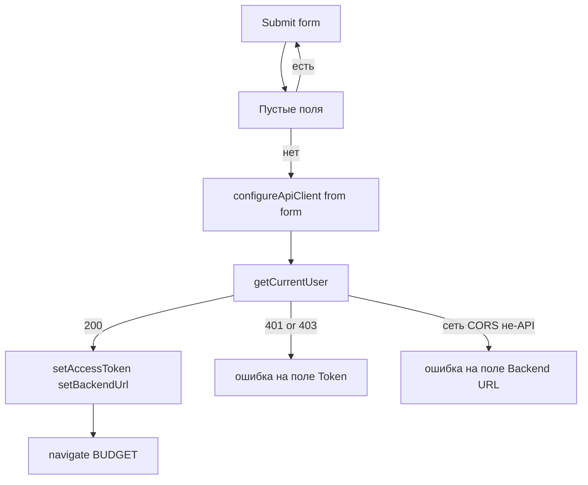

# US-003: Собрать экран логина

**История:** priority 3, `passes: false`. Ссылки на Figma нет (`designReference: []`).

**Вне скоупа:** гард `RequireAuth` и футер с вкладками (US-004), persist Query (US-005), правки `src/api`, выход (US-039).

## Контекст

US-002 уже даёт [`src/helpers/authStorage.ts`](src/helpers/authStorage.ts), [`src/helpers/configureApiClient.ts`](src/helpers/configureApiClient.ts) и [`src/helpers/normalizeBackendUrl.ts`](src/helpers/normalizeBackendUrl.ts). Клиент ходит на `baseUrl + /v1/...`. FR-1: токен и URL в `localStorage`, URL нормализуется до `…/api`.

Сейчас [`src/constants/router.ts`](src/constants/router.ts) знает только `BUDGET`. [`src/router/AppRouter.tsx`](src/router/AppRouter.tsx) рендерит одну заглушку. Папки `src/modules/login` нет. Тесты Vitest: `src/**/*.test.ts`, environment `node`. Строки UI только через i18n ([`src/i18n/en.ts`](src/i18n/en.ts)).

Проверка Firefly: брать **`getCurrentUser`** (`/v1/about/user`) из [`src/api/sdk.gen.ts`](src/api/sdk.gen.ts), не `getAbout`. About на части инстансов отвечает без валидного PAT; user-эндпоинт проверяет и URL, и токен. `throwOnError` оставить `false` (дефолт клиента): сеть/CORS приходят как `{ error, response }`, а не как throw. JSON.parse HTML при `response.ok` всё же может вылететь из клиента. Обернуть вызов в `try/catch` и считать это неверным URL.

## Шаги

### 1. Роут

В [`src/constants/router.ts`](src/constants/router.ts) добавить `LOGIN: \`${BASE_PATH}/login\``. В [`src/router/AppRouter.tsx`](src/router/AppRouter.tsx) маршрут на страницу логина. Редиректа с `/` и гарда нет. Это US-004. После успеха `navigate(ROUTE.BUDGET)`.

### 2. i18n

Ключи в [`src/i18n/en.ts`](src/i18n/en.ts), английский V1. Минимум:

- подписи Token, Backend URL, кнопка Sign in
- ошибки пустых полей
- «Invalid token» / «Invalid backend URL»
- placeholder URL из PRD: `https://firefly.example.com/api`

В компонентах `useTranslation()`. Не хардкодить строки.

### 3. Хелпер проверки

Положить в модуль: [`src/modules/login/helpers/verifyFireflyLogin.ts`](src/modules/login/helpers/verifyFireflyLogin.ts) (классификация может быть рядом, если так чище).

1. `configureApiClient({ token, backendUrl })` с значениями формы, чтобы запрос не брал старый storage.
2. `getCurrentUser()`.
3. Есть `data` → `{ ok: true }`.
4. Иначе `{ ok: false, reason }`:
   - `response.status` 401 или 403 → `invalidToken` (403 в OpenAPI нет, смотреть HTTP-статус)
   - нет `response`, сеть, CORS, HTML/не-JSON, 404/500 и прочее → `invalidBackendUrl`
5. В `switch` по `reason` ветка `never` в default.

В `localStorage` писать **только после успеха** (`setAccessToken` / `setBackendUrl`). При ошибке никуда не переходить и старые креды не затирать.

### 4. Экран

[`src/modules/login/Login.tsx`](src/modules/login/Login.tsx) + [`src/modules/login/Login.module.css`](src/modules/login/Login.module.css). Стили рядом с компонентом, не общая папка CSS.

- `@mantine/form`: обязательные Token и Backend URL, trim, пустые блокируют submit и ставят field error
- Token: `PasswordInput` (PAT). URL: `TextInput`
- Submit: loading, без повторной отправки
- Успех: persist + `configureApiClient` + `navigate` на Budget
- Ошибка API: `form.setFieldError` на Token или Backend URL по `reason`

Каркас mobile-first, тёмная тема Mantine уже в [`src/App.tsx`](src/App.tsx). Не трогать заглушку Budget.

### 5. Тесты хелпера

[`src/modules/login/tests/verifyFireflyLogin.test.ts`](src/modules/login/tests/verifyFireflyLogin.test.ts). `vi.mock` только `getCurrentUser` из `@/api/sdk.gen.ts`. `stubLocalStorage` из [`src/helpers/tests/stubLocalStorage.ts`](src/helpers/tests/stubLocalStorage.ts).

- 200 с `data` → `ok: true`, в storage нормализованный URL и токен
- 401 и 403 → `invalidToken`, storage пустой
- `response` undefined / TypeError → `invalidBackendUrl`
- не-JSON / HTML → `invalidBackendUrl`

Компонентные тесты не подключать: Vitest сейчас только `*.test.ts` и `environment: 'node'`.

## Верификация

- `npm test`
- `npx tsc -b`
- `npm run lint`
- Браузер через agent-browser (`npm run dev`, страница `/monetta/login`):
  1. Submit пустой формы: ошибки на обоих полях, URL не меняется
  2. Недоступный URL (например `http://127.0.0.1:1`): ошибка backend URL, остаёмся на логине, `localStorage` без `monetta.token`
  3. Если есть Firefly с CORS: верный PAT → переход на `/monetta/budget`, в storage оба ключа. Неверный PAT на живом API → ошибка Token

CORS с localhost на чужой Firefly часто падает. Это как раз ветка «неверный backend URL». Успешный вход в браузере зависит от инстанса с разрешённым origin.
