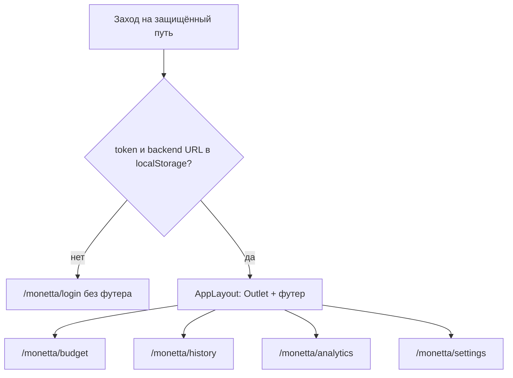

# US-004: Добавить гард авторизации и вкладки в футере

**История:** priority 4, `passes: false`. Ссылки на Figma нет (`designReference: []`).

**Вне скоупа:** persist Query (US-005), каркас Budget (US-009), Log out (US-039), правки `src/api`, контент History / Analytics / Settings.

## Контекст

US-003 уже даёт логин на `/monetta/login`, запись токена и URL только после успеха и `navigate(ROUTE.BUDGET)`. Гарда нет: `/monetta/budget` открывается без креденшалов. Футера нет.

Сейчас:

- [`src/constants/router.ts`](src/constants/router.ts) — только `LOGIN` и `BUDGET`
- [`src/router/AppRouter.tsx`](src/router/AppRouter.tsx) — два плоских маршрута
- [`src/helpers/authStorage.ts`](src/helpers/authStorage.ts) — `getAccessToken` / `getBackendUrl`, без проверки «оба есть»
- [`src/modules/budget/Budget.tsx`](src/modules/budget/Budget.tsx) — заглушка `Budget`
- [`src/components`](src/components) нет; модулей `history`, `analytics`, `settings` тоже нет (в Resolved Questions они считались созданными — их нужно завести в той же форме, что Budget)
- Phosphor уже в зависимостях; React Router 7; строки UI только через i18n

FR-2: после входа четыре вкладки в футере. PRD: навигация в футере и одна и та же на всех вкладках. Дефолт после входа — `/monetta/budget`.



## Шаги

### 1. Хелпер авторизации

В [`src/helpers/authStorage.ts`](src/helpers/authStorage.ts) добавить `hasAuthCredentials()`: оба значения из `getAccessToken()` и `getBackendUrl()` непустые после `trim`. Пустая строка в `localStorage` — не авторизован.

Тесты в [`src/helpers/tests/authStorage.test.ts`](src/helpers/tests/authStorage.test.ts) через `stubLocalStorage`:

- оба ключа есть → `true`
- нет токена / нет URL / пустая строка → `false`

`clearAuth*` не добавлять — это US-039.

### 2. Роуты

В [`src/constants/router.ts`](src/constants/router.ts):

```ts
HISTORY: `${BASE_PATH}/history`
ANALYTICS: `${BASE_PATH}/analytics`
SETTINGS: `${BASE_PATH}/settings`
```

`LOGIN` и `BUDGET` не менять. Логин по-прежнему уходит на `ROUTE.BUDGET`.

В [`src/router/AppRouter.tsx`](src/router/AppRouter.tsx) вложенные маршруты React Router 7:

- `ROUTE.LOGIN` — `<Login />`, **без** футера
- обёртка `RequireAuth` → `AppLayout` (`<Outlet />` + футер) → Budget / History / Analytics / Settings
- индекс `BASE_PATH` и неизвестный путь → `<Navigate to={ROUTE.BUDGET} replace />` (гард сам отправит на логин, если нет креденшалов)

Не редиректить с логина на Budget, если пользователь уже авторизован: в истории этого нет; достаточно гарда на остальных путях.

### 3. RequireAuth

Общий компонент в `src/components` (рядом с оболочкой, не в login): [`src/components/RequireAuth.tsx`](src/components/RequireAuth.tsx).

- нет креденшалов → `<Navigate to={ROUTE.LOGIN} replace />`
- есть → `<Outlet />`

Без сохранения `location.state` для return-to: история этого не требует.

### 4. Точки входа страниц

Как у Budget — один файл на модуль, default export:

- [`src/modules/history/History.tsx`](src/modules/history/History.tsx) — заглушка `History`
- [`src/modules/analytics/Analytics.tsx`](src/modules/analytics/Analytics.tsx) — заглушка `Analytics`
- [`src/modules/settings/Settings.tsx`](src/modules/settings/Settings.tsx) — заглушка `Settings`

Budget не переписывать. Контент вкладок — следующие истории.

### 5. Оболочка и футер

Общий chrome в `src/components`:

- [`src/components/AppLayout.tsx`](src/components/AppLayout.tsx) + [`src/components/AppLayout.module.css`](src/components/AppLayout.module.css)
- футер можно оставить в том же файле или вынести в `AppFooter.tsx` + свой CSS module, если разметка разъедется

Раскладка (нужна US-009): колонка на `100dvh`, `main` с `flex: 1` и `min-height: 0`, футер снизу, не перекрывает контент. Учесть `env(safe-area-inset-bottom)` для PWA.

Четыре вкладки — `NavLink` из `react-router`:

| Вкладка   | Путь              | Иконка Phosphor (Figma нет) |
|-----------|-------------------|-----------------------------|
| Budget    | `ROUTE.BUDGET`    | `Wallet`                    |
| History   | `ROUTE.HISTORY`   | `ClockCounterClockwise`     |
| Analytics | `ROUTE.ANALYTICS` | `ChartPieSlice`             |
| Settings  | `ROUTE.SETTINGS`  | `Gear`                      |

Список вкладок — константа рядом с футером (`src/components/constants.ts` или в том же модуле), не размазывать по роутеру. Активная вкладка — `NavLink` `isActive` + класс в CSS module. Подписи только через `useTranslation()`.

Не брать Mantine `AppShell` / `Tabs` как оболочку приложения: у логина уже свой CSS module, так проще выдержать mobile-first футер.

### 6. i18n

В [`src/i18n/en.ts`](src/i18n/en.ts), английский V1:

```ts
nav: {
  budget: 'Budget',
  history: 'History',
  analytics: 'Analytics',
  settings: 'Settings',
}
```

В компонентах `useTranslation()`. Не хардкодить подписи вкладок.

Компонентные тесты не подключать: Vitest — `*.test.ts` и `environment: 'node'`.

## Верификация

- `npm test`
- `npx tsc -b`
- `npm run lint`
- Браузер через agent-browser (`npm run dev`, база `/monetta/...`; если 5173 занят — 5174):
  1. Без `monetta.token` / `monetta.backendUrl`: `/monetta/budget`, `/monetta/history` и `/monetta` → редирект на `/monetta/login`, футера нет
  2. После успешного логина (или ручной записи обоих ключей в `localStorage`): `/monetta/budget`, внизу четыре вкладки
  3. Клики Budget → History → Analytics → Settings: URL меняется, в `main` своя заглушка, футер остаётся
  4. Активная вкладка подсвечена, остальные нет
  5. Логин по-прежнему без футера
  6. Узкая ширина (мобилка) и шире ~961px: футер на месте, контент над ним, не под ним
