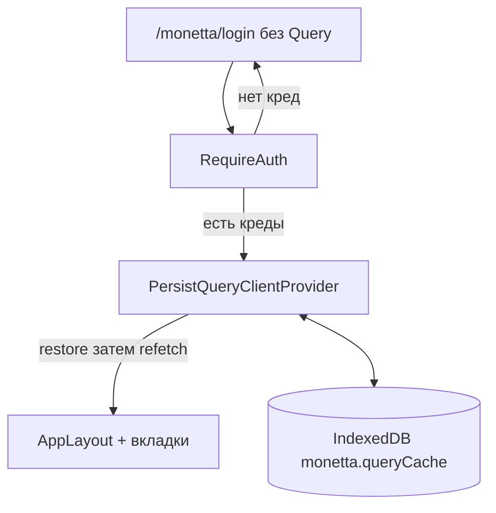

# US-005: Подключить TanStack Query с persist кеша

**История:** priority 5, `passes: false`. Ссылки на Figma нет (`designReference: []`).

**Вне скоупа:** запросы валют (US-006) и счетов (US-008), Log out и очистка кеша в Settings (US-039), правки `src/api` и перегенерация hey-api с плагином Query, очередь офлайн-мутаций, синк IndexedDB между телефоном и ПК.

## Контекст

FR-12 и Resolved Questions: при повторном открытии на этом устройстве сразу последний ответ Query, затем refetch из Firefly. Кеш свой на устройство. Между телефоном и ПК источник правды — Firefly. Токен и backend URL остаются в `localStorage`, не в Query.

US-004 уже даёт авторизованную оболочку. Learnings: Query-провайдер оборачивает **авторизованное дерево**, не логин.

Сейчас:

- [`src/App.tsx`](src/App.tsx) — `HashRouter` + `AppRouter` (пути вида `/#/monetta/budget`)
- [`src/router/AppRouter.tsx`](src/router/AppRouter.tsx) — `LOGIN` снаружи; `RequireAuth` → `AppLayout` → страницы
- TanStack Query в `package.json` нет
- [`openapi-ts.config.ts`](openapi-ts.config.ts) — только `@hey-api/client-fetch`; `src/api` не трогать
- Vitest: `*.test.ts`, `environment: 'node'` — IndexedDB нет, мокать хранилище

Первых `useQuery` в этой истории нет: достаточно клиента, persist и провайдера. Хуки появятся в US-006 / US-008.



## Шаги

### 1. Зависимости

Поставить:

- `@tanstack/react-query`
- `@tanstack/react-query-persist-client`
- `idb-keyval`

Не ставить `@tanstack/query-async-storage-persister` и не писать persist в `localStorage`: в ТЗ явно IndexedDB. Devtools не подключать.

Не включать `@tanstack/react-query` в `openapi-ts` и не регенерировать `src/api`.

### 2. QueryClient

Фабрика в [`src/helpers/createQueryClient.ts`](src/helpers/createQueryClient.ts) (рядом с `configureApiClient`, не синглтон на модуле — инстанс живёт в провайдере через `useState`).

Дефолты:

- `gcTime`: 24 часа. Должен быть ≥ `maxAge` persist, иначе гидрация выкинет снимок через 5 минут (дефолт Query).
- `staleTime`: 5 минут. Переключение вкладок Budget / History / Analytics / Settings не должно заново качать те же ключи, если данные ещё свежие.
- `retry`: коротко (1), без бесконечных ретраев на логине — логин Query не использует.

Клиент создавать один раз в провайдере: `useState(() => createQueryClient())`. Не создавать `new QueryClient()` на каждый рендер.

В этом же файле или в [`src/helpers/createQueryPersister.ts`](src/helpers/createQueryPersister.ts) короткий комментарий (история это требует):

```ts
// Query cache is per-device (IndexedDB). Source of truth between phone and PC is Firefly.
```

### 3. Persister IndexedDB

Свой persister по [доке persistQueryClient](https://tanstack.com/query/latest/docs/framework/react/plugins/persistQueryClient): `get` / `set` / `del` из `idb-keyval`, интерфейс `Persister` (`persistClient` / `restoreClient` / `removeClient`).

Ключ хранилища: `monetta.queryCache` (рядом с `monetta.token` / `monetta.backendUrl`). Константа в helpers, не магическая строка в JSX.

`maxAge` persist: 24 часа, как `gcTime`.

`removeClient` в UI не вызывать — это US-039 (вместе с `queryClient.clear()`). Достаточно экспортировать фабрику persister, чтобы выход потом вызвал один и тот же ключ.

### 4. Провайдер на авторизованном дереве

Компонент в `src/components`, как `RequireAuth` / `AppLayout`: [`src/components/QueryPersistenceProvider/QueryPersistenceProvider.tsx`](src/components/QueryPersistenceProvider/QueryPersistenceProvider.tsx).

Внутри: `PersistQueryClientProvider` (он уже включает `QueryClientProvider`) + `<Outlet />`.

В [`src/router/AppRouter.tsx`](src/router/AppRouter.tsx):

```tsx
<Route element={<RequireAuth />}>
  <Route element={<QueryPersistenceProvider />}>
    <Route element={<AppLayout />}>
      {/* Budget, History, Analytics, Settings */}
    </Route>
  </Route>
</Route>
```

Логин остаётся сиблингом, без провайдера: `getCurrentUser` при входе по-прежнему прямой вызов SDK.

Поведение restore (FR-12 vs «не качать при каждом заходе на вкладку»):

- `PersistQueryClientProvider` не стартует fetch, пока restore не закончится; закешированные данные можно сразу рисовать.
- После restore провайдер рефетчит, если данные stale. Чтобы **холодный старт** всегда ходил в Firefly, а **смена вкладки** нет: `onSuccess` restore → `queryClient.invalidateQueries()`. Провайдер остаётся смонтированным при переходах по футеру, `onSuccess` не сработает снова.
- Не инвалидировать на каждый `refetchOnWindowFocus`, если это снова начнёт качать все вкладки; дефолт Query (`refetchOnWindowFocus: true` только для stale) совместим со `staleTime: 5 мин`.

Не оборачивать всё `App` в провайдер: логин не должен писать в IndexedDB.

### 5. Тесты

Vitest `node` — без настоящего IndexedDB. Мокать `idb-keyval`.

[`src/helpers/tests/createQueryClient.test.ts`](src/helpers/tests/createQueryClient.test.ts):

- `gcTime` 24ч, `staleTime` 5 мин

[`src/helpers/tests/createQueryPersister.test.ts`](src/helpers/tests/createQueryPersister.test.ts):

- `persistClient` вызывает `set` с ключом `monetta.queryCache`
- `restoreClient` возвращает то, что `get`
- `removeClient` вызывает `del`

Компонентные тесты провайдера не писать (`environment: 'node'`).

## Верификация

- `npm test`
- `npx tsc -b`
- `npm run lint`
- Браузер (agent-browser, `npm run dev`; роутер — **HashRouter**, URL вида `/#/monetta/login`):
  1. Без креденшалов логин открывается, в DevTools нет `monetta.queryCache` до входа
  2. После входа Budget / History / Analytics / Settings по-прежнему с футером, без ошибок в консоли
  3. После входа в IndexedDB появляется БД `keyval-store` (idb-keyval) с ключом `monetta.queryCache` (снимок может быть почти пустым — запросов ещё нет)
  4. Reload на `/#/monetta/budget` с сохранёнными кредами: оболочка сразу, без отброса на логин
