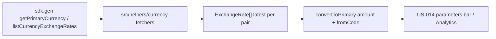

# US-006: Загружать основную валюту и конвертировать курсами Firefly

**История:** priority 6, `passes: false`. Ссылок на Figma нет (`designReference: []`).

**Вне скоупа:** UI parameters bar и итоги месяца (US-014), полный список валют для пикера создания счёта (US-016), хуки `useQuery` и query keys (первый потребитель — US-014), курсы на конкретную дату, правки `src/api`, логин/роутер/заглушка Budget.

## Контекст

FR-11 и Resolved Questions: мультивалютные итоги переводятся в основную валюту кошелька курсами Firefly. Карточки счетов остаются в своей валюте (US-010). Эта история — только слой данных в `src/helpers`.

US-005 уже даёт Query + persist на авторизованном дереве. Первых `useQuery` всё ещё нет: достаточно fetch-функций, которые US-014 обернёт в Query. `src/api` не трогать; SDK уже сгенерирован.

Эндпоинты:

- `getPrimaryCurrency()` → `GET /v1/currencies/primary` → `CurrencySingle` (`data.attributes`: `code`, `name`, `symbol`, `decimal_places`, `primary`)
- `listCurrencyExchangeRates({ query: { page, limit } })` → `GET /v1/exchange-rates` → `CurrencyExchangeRateArray` (по умолчанию 50 на страницу, `meta.pagination.total_pages`)

Семантика курса в схеме: *сколько единиц `to` дают за 1 единицу `from`*. Обратный курс Firefly может не хранить явно — конвертер считает `1/rate`.

`throwOnError` остаётся `false` (как в логине). HTML-как-JSON и сеть по-прежнему могут бросить — ловить и пробрасывать/мапить в ошибку fetch-хелпера.



Сейчас: [`src/helpers`](src/helpers) — auth, API config, Query; [`src/modules/budget/Budget.tsx`](src/modules/budget/Budget.tsx) — заглушка. Папки `src/types` нет. Vitest: `*.test.ts`, `environment: 'node'`, мок SDK как в [`src/modules/login/tests/verifyFireflyLogin.test.ts`](src/modules/login/tests/verifyFireflyLogin.test.ts).

## Шаги

### 1. Типы

Папка [`src/helpers/currency/`](src/helpers/currency/) — по образцу [`src/helpers/query/`](src/helpers/query/). Свои типы, не протаскивать JSON:API наружу:

```ts
type WalletCurrency = {
  code: string;
  name: string;
  symbol: string;
  decimalPlaces: number;
};

type ExchangeRate = {
  fromCode: string;
  toCode: string;
  rate: number;
  date: string;
};
```

`src/types` не заводить: тип нужен helpers и позже Budget/Analytics через импорт из `@/helpers/currency/...`.

### 2. `fetchPrimaryCurrency`

[`src/helpers/currency/fetchPrimaryCurrency.ts`](src/helpers/currency/fetchPrimaryCurrency.ts): вызвать `getPrimaryCurrency` из `@/api/sdk.gen.ts`.

- есть `result.data?.data?.attributes?.code` → вернуть `WalletCurrency` (`decimalPlaces` из `decimal_places`, иначе `2`)
- нет `data` или нет `code` → throw (для будущего `queryFn`)
- `try/catch` вокруг вызова: SyntaxError/сеть тоже throw, не глотать

Не вызывать `primaryCurrency` (это POST «сделать валюту основной»).

### 3. `fetchExchangeRates`

[`src/helpers/currency/fetchExchangeRates.ts`](src/helpers/currency/fetchExchangeRates.ts): `listCurrencyExchangeRates` со всеми страницами (`limit` 50 или выше, цикл по `meta.pagination` пока `current_page < total_pages`).

Из каждого элемента взять `from_currency_code`, `to_currency_code`, `rate`, `date`; пропустить дырявые. `rate` в API — строка → `Number`.

Схлопнуть пары `from+to`: оставить запись с самой новой `date` (ISO-сравнение строк достаточно). Нормализовать коды в uppercase, чтобы `eur` и `EUR` не расходились.

Пустой список курсов — валидный ответ (кошелёк в одной валюте). Ошибка сети / нет `data` — throw.

### 4. Конвертер

[`src/helpers/currency/convertToPrimary.ts`](src/helpers/currency/convertToPrimary.ts) — чистая функция, без SDK:

`convertToPrimary({ amount, fromCode, primaryCode, rates }) → number | null`

1. `fromCode` и `primaryCode` сравнивать case-insensitive.
2. Тот же код → вернуть `amount` (в т.ч. `0`).
3. Прямой курс `from → primary` → `amount * rate`.
4. Иначе обратный `primary → from` → `amount / rate` (rate ≠ 0).
5. Курса нет → `null`. Не подставлять `1:1` и не ходить через третью валюту.
6. Не округлять по `decimalPlaces` — это форматирование UI (US-014).

Параметра `date` в этой истории нет: берём уже схлопнутый latest из шага 3. Исторический курс на конец месяца — не здесь.

### 5. Тесты

Файлы в [`src/helpers/tests/`](src/helpers/tests/), как у остальных общих helpers. Мок `@/api/sdk.gen.ts`. Компонентные тесты не писать.

`fetchPrimaryCurrency.test.ts`:

- мапит `attributes` в `WalletCurrency`
- throw, если `data` нет или нет `code`
- throw, если SDK кидает SyntaxError (HTML вместо JSON)

`fetchExchangeRates.test.ts`:

- собирает курсы с двух страниц
- для одной пары оставляет более новую `date`
- пустой `data: []` → `[]`
- throw без `data`

`convertToPrimary.test.ts`:

- EUR→EUR → как есть
- прямой EUR→USD rate `1.1`, amount `10` → `11`
- только обратный USD→EUR rate `0.5`, from EUR, primary USD → `20`
- нет пары → `null`
- коды разного регистра совпадают

## Верификация

- `npm test`
- `npx tsc -b`
- `npm run lint`

Браузер для приёмки не нужен: UI нет, `Verify in browser` в changes истории нет. Регрессию оболочки не ждать; если dev-сервер уже запущен — логин и четыре вкладки должны открываться как после US-005.
