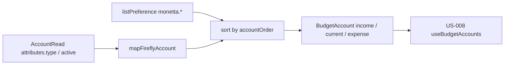

# US-007: Задать модель счёта Budget и сопоставить её с Firefly

**История:** priority 7, `passes: false`. Ссылок на Figma нет (`designReference: []`).

**Вне скоупа:** UI Budget (US-009/010), `useQuery` и `useBudgetAccounts` (US-008), `listAccount` (US-008), палитра/пикер иконок (US-015), модалки создания (US-016), правки `src/api`, логин/роутер/заглушка `Budget.tsx`.

## Контекст

FR-3, FR-4, FR-5 и Resolved Questions: один тип счёта Budget из ответа Firefly и preferences. Иконки, цвета и порядка в полях счёта Firefly нет — пишем в preferences. Скрытые (`active=false`) в приложении не показываем. Тип после создания не меняется; liability = Expense + долг.

US-006 уже дал helpers валют в `src/helpers/currency/`. Счета живут в модуле Budget: типы в `src/modules/budget/types`, маппинг и preferences в `src/modules/budget/helpers`, тесты в `src/modules/budget/tests`. `src/types` не заводить.

Сейчас: [`src/modules/budget/Budget.tsx`](src/modules/budget/Budget.tsx) — заглушка. Папок `types` / `helpers` / `tests` у budget нет. Образец модуля — [`src/modules/login/`](src/modules/login/). Vitest: `*.test.ts`, `environment: 'node'`, мок SDK как в [`src/helpers/tests/fetchExchangeRates.test.ts`](src/helpers/tests/fetchExchangeRates.test.ts).

Эндпоинты preferences (сгенерированный SDK, `src/api` не трогать):

- `listPreference({ query: { page, limit } })` → `GET /v1/preferences` (по умолчанию 50 на страницу, `meta.pagination.total_pages`)
- `updatePreference({ path: { name }, body: { data } })` → `PUT /v1/preferences/{name}` — «always overwrite, created if it does not exist»
- `storePreference` не нужен, если PUT создаёт отсутствующий ключ

`PolymorphicProperty` в схеме — `boolean | string | Array<string>`, **не объект**. Appearance нельзя класть как `{ icon, color }`. Appearance — JSON-строка; порядок — массив id.

Имена ключей — тот же префикс **`monetta`**, что у `monetta.token` / `monetta.backendUrl` / `monetta.queryCache` (в `feature.json` раньше была опечатка `moneta`):

- `monetta.accountAppearance.<accountId>` → `'{"icon":"Wallet","color":"#4C6EF5"}'`
- `monetta.accountOrder.<block>` → `["1","5","3"]`, где block = `income` | `current` | `expense`

`throwOnError` остаётся `false`. HTML-как-JSON и сеть могут бросить — ловить и пробрасывать, как в currency fetchers.



## Шаги

### 1. Типы и константы

[`src/modules/budget/types/budgetAccount.ts`](src/modules/budget/types/budgetAccount.ts) и [`src/modules/budget/constants.ts`](src/modules/budget/constants.ts).

```ts
type AccountType = 'INCOME' | 'CURRENT' | 'EXPENSE';
type AccountBlock = 'income' | 'current' | 'expense';

type AccountAppearance = {
  icon: string;
  color: string;
};

type BudgetAccount = {
  id: string;
  name: string;
  type: AccountType;
  isDebt: boolean;
  icon: string;
  color: string;
  balance: number;
  currencyCode: string;
  currencySymbol: string;
  debtAmount: number | null;
  paidAmount: number | null;
};
```

- `icon` — строковый ключ Phosphor **без** суффикса `Icon` (как позже в US-015). Helpers не импортируют `@phosphor-icons/react`.
- Дефолты, если preference нет или JSON битый: `DEFAULT_ACCOUNT_ICON = 'Wallet'`, `DEFAULT_ACCOUNT_COLOR = '#4C6EF5'` (Mantine indigo). Полный набор иконок/цветов — не здесь.
- `debtAmount` / `paidAmount` только для `isDebt`; иначе `null`. Карточки в своей валюте, в primary не конвертировать (US-010 / US-006).
- Константы ключей: `ACCOUNT_APPEARANCE_PREFIX = 'monetta.accountAppearance.'`, `ACCOUNT_ORDER_PREFIX = 'monetta.accountOrder.'`, `PREFERENCES_PAGE_LIMIT = 50`.
- `ACCOUNT_TYPE` / `ACCOUNT_BLOCK` как `as const`, не магические строки в маппере.

### 2. Маппинг Firefly → BudgetAccount

[`src/modules/budget/helpers/mapFireflyAccount.ts`](src/modules/budget/helpers/mapFireflyAccount.ts) — чистая функция, без SDK.

Вход: `AccountRead` (или `{ id, attributes }`) + optional `AccountAppearance`.

Правила:

| `attributes.type` | результат |
| --- | --- |
| `revenue` | `INCOME`, `isDebt: false` |
| `asset` | `CURRENT`, `isDebt: false` |
| `expense` | `EXPENSE`, `isDebt: false` |
| `liability` или `liabilities` | `EXPENSE`, `isDebt: true` |
| `cash`, `import`, `initial-balance`, `reconciliation`, прочее | `null` (пропустить) |

Ещё пропуск:

- нет `id` или пустое `name`
- `active === false` (нет поля `active` → считать `true`, дефолт схемы)

Поля:

- `balance` — `Number(current_balance)`, неfinite → `0`
- `currencyCode` — uppercase `currency_code` или fallback `primary_currency_code`; пусто → `''`
- `currencySymbol` — `currency_symbol` или `primary_currency_symbol` или `''`
- долг: `debtAmount` = `Number(debt_amount)`, если finite, иначе `Math.abs(balance)`; `paidAmount` = `max(0, abs(Number(opening_balance)) - debtAmount)`, если `opening_balance` парсится, иначе `0`
- `icon` / `color` из appearance или дефолты

Не протаскивать JSON:API (`attributes`, `type: "accounts"`) наружу.

### 3. Сборка списков и порядок

[`src/modules/budget/helpers/toBudgetAccounts.ts`](src/modules/budget/helpers/toBudgetAccounts.ts):

```ts
toBudgetAccounts(items, prefs) → {
  income: BudgetAccount[];
  current: BudgetAccount[];
  expense: BudgetAccount[];
}
```

1. Каждый item через `mapFireflyAccount` + appearance по id.
2. Разложить по `type`.
3. Внутри блока: id из `monetta.accountOrder.<block>` в этом порядке (только существующие); остальные — в конце, в порядке исходного списка Firefly. Дубликаты в order выкинуть. Слот Add account не моделировать (UI, US-011).

Отдельная чистая `sortAccountsByOrder(accounts, orderedIds)` — проще тестировать.

### 4. Чтение preferences

[`src/modules/budget/helpers/fetchAccountPreferences.ts`](src/modules/budget/helpers/fetchAccountPreferences.ts): `listPreference` со всеми страницами (`limit` 50, цикл как `fetchExchangeRates`).

Вернуть:

```ts
type AccountPreferences = {
  appearanceById: Record<string, AccountAppearance>;
  orderByBlock: Record<AccountBlock, string[]>;
};
```

Парсинг:

- имя `monetta.accountAppearance.<id>` → JSON.parse строки `{ icon, color }`; битый JSON / не-строка / нет полей → пропустить (сработают дефолты)
- имя `monetta.accountOrder.income|current|expense` → массив строк; не-массив → `[]`
- прочие Firefly preferences игнорировать
- пустой `data: []` — валидно (все дефолты)
- нет `data` / сеть / SyntaxError → throw

Не вызывать `getPreference` по одному id: при N счетах это N запросов.

### 5. Запись preferences

[`src/modules/budget/helpers/writeAccountAppearance.ts`](src/modules/budget/helpers/writeAccountAppearance.ts) и [`src/modules/budget/helpers/writeAccountOrder.ts`](src/modules/budget/helpers/writeAccountOrder.ts) (или один файл `writeAccountPreferences.ts`).

- appearance: `updatePreference({ path: { name: `${ACCOUNT_APPEARANCE_PREFIX}${id}` }, body: { data: JSON.stringify({ icon, color }) } })`
- order: `updatePreference({ path: { name: `${ACCOUNT_ORDER_PREFIX}${block}` }, body: { data: ids } })` — `data` это `string[]`

После ответа без ошибки вернуть записанное значение. Нет `data` в ответе / throw SDK → throw. Потребители записи — US-017 (create), US-020 (edit), US-027 (reorder); хелперы должны быть готовы сейчас.

Не писать appearance «на лету» при маппинге, если preference ещё нет: дефолты только в памяти. Первая запись — при создании/правке счёта.

### 6. Тесты

Файлы в [`src/modules/budget/tests/`](src/modules/budget/tests/). Компонентные тесты не писать. Мок `@/api/sdk.gen.ts` только у fetch/write.

`mapFireflyAccount.test.ts`:

- revenue / asset / expense / liability (+ `liabilities`)
- `active: false` → `null`
- cash / unknown → `null`
- нет appearance → дефолтные icon/color
- долг: `debtAmount` и `paidAmount` из `debt_amount` и `opening_balance`

`toBudgetAccounts.test.ts` / `sortAccountsByOrder.test.ts`:

- раскладка по трём блокам
- order preference переставляет; неизвестные id игнорируются; счета не из списка — в конце
- expense и debt в одном массиве `expense`

`fetchAccountPreferences.test.ts`:

- две страницы, фильтр только `monetta.*`
- JSON appearance и массив order
- пустой `data: []` → пустые maps / пустые order
- throw без `data`

`writeAccountPreferences.test.ts`:

- PUT appearance JSON-строкой
- PUT order массивом id
- throw, если SDK кидает / нет успешного payload

## Верификация

- `npm test`
- `npx tsc -b`
- `npm run lint`

Браузер для приёмки не нужен: UI нет, `Verify in browser` в changes истории нет. Регрессию оболочки не ждать; если dev-сервер уже запущен — логин и четыре вкладки должны открываться как после US-006.
