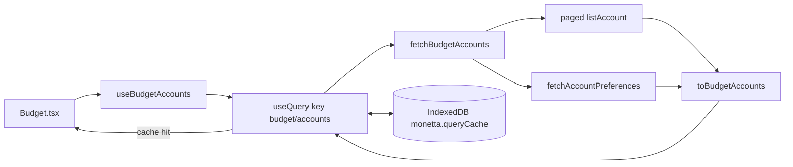

# US-008: Загружать счета Budget через Query

**История:** priority 8, `passes: false`. Ссылок на Figma нет (`designReference: []`).

**Вне скоупа:** каркас Budget (parameters bar, три блока, flex, футер) — US-009; карточки — US-010; пагинация сеток — US-011/012; месяц и `date` у `listAccount` — US-013; итоги бара — US-014; мутации счетов и `invalidateQueries` — US-017+; правки `src/api`; логин, роутер, Query-провайдер.

## Контекст

FR-12: при повторном открытии на этом устройстве сразу последний кеш Query, затем refetch из Firefly. US-005 уже даёт `PersistQueryClientProvider` на авторизованном дереве: restore → `invalidateQueries()`. US-007 дал модель, маппинг и preferences. Первого `useQuery` в приложении ещё нет.

Learnings US-007: вынести общий цикл страниц Firefly, когда появится `listAccount`. `icon`/`color` остаются `string | null`. Карточки в валюте счёта, не в primary.

Сейчас: [`src/modules/budget/Budget.tsx`](src/modules/budget/Budget.tsx) — заглушка `<div>Budget</div>`. Хука нет. Query-ключи не заведены.

Эндпоинт (SDK, `src/api` не трогать):

- `listAccount({ query: { page, limit } })` → `GET /v1/accounts` (по умолчанию 50 на страницу, `meta.pagination.total_pages`)
- `date` / `start` / `end` / `type` **не передавать**: баланс на дату — US-013; маппер уже отсекает чужие типы и `active: false`

`throwOnError` остаётся `false`. HTML-как-JSON и сеть ловить и пробрасывать, как в currency fetchers.



## Шаги

### 1. Общий цикл страниц Firefly

[`src/helpers/firefly/collectFireflyPages.ts`](src/helpers/firefly/collectFireflyPages.ts) (или `src/helpers/collectFireflyPages.ts`, если папка `firefly/` кажется лишней — один файл рядом с `configureApiClient` тоже ок). Тесты — [`src/helpers/tests/collectFireflyPages.test.ts`](src/helpers/tests/collectFireflyPages.test.ts).

```ts
type FireflyListPayload<T> = {
  data?: T[];
  meta?: { pagination?: { total_pages?: number } };
};

collectFireflyPages<T>(
  fetchPage: (page: number) => Promise<{ data?: FireflyListPayload<T> }>,
  missingError: string,
): Promise<T[]>
```

Поведение как у текущих циклов в [`fetchExchangeRates.ts`](src/helpers/currency/fetchExchangeRates.ts) и [`fetchAccountPreferences.ts`](src/modules/budget/helpers/fetchAccountPreferences.ts):

- `page` с 1, `limit` задаёт вызывающий внутри `fetchPage`
- нет `payload` / нет `data` → throw `missingError`
- пустой `data: []` — валидно
- `total_pages` из `meta.pagination`, иначе текущая страница
- SDK throw / не-Error → `Error(missingError)`

Перевести на хелпер:

- `fetchAccountPreferences` — собрать все `PreferenceRead`, затем существующий разбор appearance/order
- `fetchExchangeRates` — собрать все rate-read, затем существующий `mapExchangeRate` / `keepLatestByPair`

Лимит 50 не сливать в одну глобальную константу без нужды: оставить `PREFERENCES_PAGE_LIMIT` и `EXCHANGE_RATES_PAGE_LIMIT`, для счетов — `ACCOUNTS_PAGE_LIMIT = 50` в [`src/modules/budget/constants.ts`](src/modules/budget/constants.ts).

### 2. `fetchBudgetAccounts`

[`src/modules/budget/helpers/fetchBudgetAccounts.ts`](src/modules/budget/helpers/fetchBudgetAccounts.ts).

```ts
export const fetchBudgetAccounts = async (): Promise<BudgetAccountsByBlock> => {
  const [items, prefs] = await Promise.all([
    collectFireflyPages(
      (page) => listAccount({ query: { page, limit: ACCOUNTS_PAGE_LIMIT } }),
      ACCOUNTS_MISSING_ERROR,
    ),
    fetchAccountPreferences(),
  ]);

  return toBudgetAccounts(items, prefs);
};
```

- Константа ошибки: `ACCOUNTS_MISSING_ERROR = 'Budget accounts are missing'` (английский, не UI-строка)
- Не писать appearance при маппинге
- Не вызывать `listAccount` четыре раза с `type`; один список `all`, фильтр в `mapFireflyAccount`

### 3. Query-ключ и хук

Ключ в [`src/modules/budget/constants.ts`](src/modules/budget/constants.ts):

```ts
export const BUDGET_ACCOUNTS_QUERY_KEY = ['budget', 'accounts'] as const;
```

Не класть месяц в ключ — его ещё нет. Позже US-013 может расширить ключ, если появится `date`.

[`src/modules/budget/hooks/useBudgetAccounts.ts`](src/modules/budget/hooks/useBudgetAccounts.ts):

```ts
export const useBudgetAccounts = () => {
  const query = useQuery({
    queryKey: BUDGET_ACCOUNTS_QUERY_KEY,
    queryFn: fetchBudgetAccounts,
  });

  const accounts = query.data ?? emptyAccountsByType();

  return {
    income: accounts[ACCOUNT_TYPE.INCOME],
    current: accounts[ACCOUNT_TYPE.CURRENT],
    expense: accounts[ACCOUNT_TYPE.EXPENSE],
    isPending: query.isPending,
    isFetching: query.isFetching,
    isError: query.isError,
    error: query.error,
  };
};
```

- `emptyAccountsByType` не дублировать: либо экспортировать из `toBudgetAccounts.ts`, либо маленький хелпер рядом с типами. Не копипастить объект три раза.
- Не ставить `placeholderData` / `initialData`: persist US-005 уже гидрирует кеш; на cold start провайдер сам делает `invalidateQueries()`.
- Не тестировать хук компонентным тестом (Vitest `environment: 'node'`, без Testing Library). Покрыть fetcher.

Образец хука модуля — [`src/modules/login/hooks/useLoginForm.ts`](src/modules/login/hooks/useLoginForm.ts): один файл, без бочки `index.ts`.

### 4. Провод в Budget (минимум для кеша)

Чтобы приёмка «кеш, потом refetch» была видна, [`Budget.tsx`](src/modules/budget/Budget.tsx) вызывает `useBudgetAccounts` и рисует **имена** счетов по трём массивам. Не собирать parameters bar, сетки, точки, Add account.

- Строки через i18n (`src/i18n/en.ts`): заголовки блоков `budget.income` / `budget.current` / `budget.expense` (US-009 переиспользует), loading `budget.loading`, ошибка `budget.errors.loadFailed`. Имена счетов — с Firefly, не переводить.
- Пока нет `data` и `isPending` — показать loading. Если есть данные из persist — сразу список, даже при `isFetching`.
- CSS-модуль не обязателен: раскладка страницы — US-009. Достаточно семантических списков.
- Долг остаётся в `expense` (уже так в `toBudgetAccounts`). Отдельный блок Debt не делать.

`invalidateQueries` после мутаций не здесь — нечем мутировать.

## Тесты

[`src/modules/budget/tests/fetchBudgetAccounts.test.ts`](src/modules/budget/tests/fetchBudgetAccounts.test.ts). Мок `@/api/sdk.gen.ts`: `listAccount` и `listPreference` (или мок `fetchAccountPreferences`, если так проще не дублировать разбор prefs — предпочтительно мокать SDK, как в US-006/007).

- две страницы счетов + prefs → блоки, порядок из `monetta.accountOrder.*`, debt в `expense`
- `active: false` и `cash` не попадают в результат
- пустой `data: []` у accounts → три пустых массива
- нет `data` / throw SDK → `ACCOUNTS_MISSING_ERROR`

[`src/helpers/tests/collectFireflyPages.test.ts`](src/helpers/tests/collectFireflyPages.test.ts): две страницы, пустой список, missing `data`, не-Error throw.

Существующие тесты `fetchAccountPreferences` и `fetchExchangeRates` должны остаться зелёными после перевода на общий цикл.

Компонентные тесты Budget не писать.

## Верификация

- `npm test`
- `npx tsc -b`
- `npm run lint`
- Браузер (agent-browser MCP), логин уже есть:

  1. Открыть `/monetta/budget` после входа: после загрузки видны имена income / current / expense (включая liability как expense). Скрытые счета отсутствуют.
  2. Hard reload той же вкладки: имена появляются сразу из IndexedDB (`monetta.queryCache`), затем уходит refetch на Firefly (Network: `GET .../v1/accounts` и preferences). Если счета на сервере те же — список не «моргает» пустым.
  3. History / Analytics / Settings и обратно на Budget: данные с хука, без повторного холодного экрана (провайдер смонтирован, `staleTime` 1 час). После restore+invalidate на самом первом заходе refetch ожидаем.
  4. Регрессия: логин без футера; четыре вкладки на месте; заглушка Budget больше не текст «Budget» без данных.

Dev-сервер: `npm run dev`, порт может быть 5175 (`strictPort`). Живой Firefly нужен для шагов 1–3; без инстанса проверить typecheck/lint/test и пустую ошибку загрузки.
