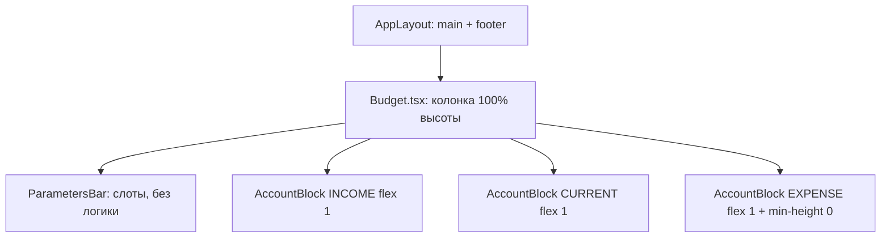

# US-009: Собрать каркас страницы Budget

**История:** priority 9, `passes: false`. Ссылок на Figma нет (`designReference: []`).

**Вне скоупа:** карточки счетов (US-010); пагинация Income/Current (US-011) и Expense (US-012); `MonthPickerInput` и месяц в query (US-013); итоги Income/Expenses/Balance (US-014); кнопка Edit и DnD (US-027); модалки счетов и транзакций; правки `src/api`; роутер, футер, Query-хук.

## Контекст

US-008 уже грузит счета через `useBudgetAccounts` и рисует имена в трёх списках. Layout chrome ещё нет: страница — обычный `
` со списками, `AppLayout` `main` скроллится.

PRD §1: вкладка Budget — parameters bar + три блока счетов; футер уже в `AppLayout`. FR-3: три блока Income, Current, Expense.

Learnings: Budget заполняет `AppLayout` `main`; заголовки блоков — уже существующие `budget.income` / `budget.current` / `budget.expense`; `data === undefined` — нет кеша; пустые массивы — валидный кеш. Vitest — `*.test.ts` + `environment: 'node'`, компонентных тестов нет.

Сейчас:

- [`src/modules/budget/Budget.tsx`](src/modules/budget/Budget.tsx) — loading/error абзацем, иначе три `AccountNameList`
- [`src/modules/budget/components/AccountNameList/AccountNameList.tsx`](src/modules/budget/components/AccountNameList/AccountNameList.tsx) — `<h2>` + `<ul>` имён, без CSS module
- [`src/components/AppLayout/AppLayout.module.css`](src/components/AppLayout/AppLayout.module.css) — колонка `height: 100%`; `main` — `flex: 1; min-height: 0; overflow: auto`; футер `flex-shrink: 0`
- `html, body, #root` — `height: 100%; overflow: hidden`

## Шаги

### 1. Страница — колонка на всю высоту `main`

Заполнить [`Budget.tsx`](src/modules/budget/Budget.tsx) + [`Budget.module.css`](src/modules/budget/Budget.module.css) рядом (как Login).

- Колонка `display: flex; flex-direction: column; height: 100%; min-height: 0; overflow: hidden`
- Сверху parameters bar (`flex-shrink: 0`)
- Ниже три блока, у каждого `flex: 1`
- У блока Expense обязательно `min-height: 0` — иначе flex-ребёнок не сожмётся, и US-012 не сможет мерить высоту сетки через ResizeObserver
- Футер **не** дублировать: он уже в `AppLayout`

`useBudgetAccounts` не менять. Ветку `!data` оставить: `isError` → `budget.errors.loadFailed`, иначе `budget.loading`. При наличии `data` (в том числе пустые массивы) показывать каркас и `data[ACCOUNT_TYPE.*]`, не `data ?? empty`.

Если страница не занимает высоту `main`, поправить только overflow у `main` (например `hidden` вместо `auto`) — не трогать футер и вложенность роутера. `HashRouter` не менять.

### 2. Parameters bar — только каркас

Новый компонент [`src/modules/budget/components/ParametersBar/ParametersBar.tsx`](src/modules/budget/components/ParametersBar/ParametersBar.tsx) + `ParametersBar.module.css`.

PRD §1.1, пять слотов:

| Слот | Сейчас | Когда появится логика |
| Income | подпись + плейсхолдер суммы | US-014 |
| Expenses | подпись + плейсхолдер суммы | US-014 |
| Balance | подпись + плейсхолдер суммы | US-014 |
| Month | подпись, без `MonthPickerInput` | US-013 |
| Edit | кнопка-заглушка без режима сортировки | US-027 |

Не считать итоги, не ходить в курсы, не подключать `@mantine/dates`. Строки через i18n, например `budget.parameters.income` / `expenses` / `balance` / `month` / `edit`. У блока счетов ключ `budget.expense` («Expense»), у бара — «Expenses». Плейсхолдер суммы — `'—'` или пусто, не хардкод валюты.

На мобилке бар может переноситься; высота живая, `flex-shrink: 0`.

### 3. Блоки счетов: заголовок + слот под сетку

Заменить `AccountNameList` на [`AccountBlock`](src/modules/budget/components/AccountBlock/AccountBlock.tsx) + `AccountBlock.module.css`. Папку `AccountNameList` удалить.

- Заголовок: `t(\`budget.${type.toLowerCase()}\`)` — ключи US-008
- Слот под будущую сетку: `flex: 1; min-height: 0` (у Expense обязательно)
- `flex: 1` на корне блока, чтобы три блока делили место под баром поровну
- Сетку, карточки, точки, свайп, Add account **не** делать

Имена счетов из `data[type]` оставить **внутри слота** как временный контент (список / текст), пока US-010 не заменит их карточками. Так видно, что Query жив, и слот не пустой. Имена с Firefly, не через i18n.

`Budget.tsx` рендерит три блока: `ACCOUNT_TYPE.INCOME` / `CURRENT` / `EXPENSE` (или `Object.values`, как сейчас). Не переименовывать ключи хука в `income`/`current`/`expense`.

### 4. Стили и i18n

- CSS modules только рядом с компонентом: `Budget.module.css`, `ParametersBar.module.css`, `AccountBlock.module.css`. Общей папки стилей модуля нет
- Токены Mantine: `var(--mantine-spacing-*)`, `var(--mantine-color-*)`, не сырые px где уже есть токен
- Новые пользовательские строки — только в [`src/i18n/en.ts`](src/i18n/en.ts)
- Тёмную тему, `QueryPersistenceProvider`, футер не трогать

Новых Vitest-файлов не нужно: история не просит тесты, раннер без DOM. Существующие тесты хука/маппера не ломать.

## Проверка

1. **`npm test`** — существующие тесты зелёные.
2. **`npx tsc -b --pretty false`** — без ошибок; неизвестные i18n-ключи падают на typecheck.
3. **`npm run lint`** — без новых замечаний в файлах истории.
4. **Браузер** (agent-browser MCP), URL с `HashRouter`: `/#/monetta/login` → `/#/monetta/budget`.

Чеклист в браузере:

- После входа Budget — колонка над футером, без второго футера и без скролла всей страницы за пределы `main`
- Сверху parameters bar: Income, Expenses, Balance, Month, Edit (без рабочих контролов)
- Три блока с заголовками Income / Current / Expense, делят оставшуюся высоту (`flex: 1`)
- Expense сжимается (`min-height: 0`), не выталкивает футер
- При живом Firefly / кеше Query имена счетов видны в слотах; loading и ошибка загрузки по-прежнему показываются, если `data` нет
- История / Analytics / Settings: футер на месте, контент заглушек не сломан
- Мобилка и ширина ≥961px: колонка на всю высоту, бар не обрезан

Готово, когда каркас виден, typecheck проходит, следующие истории (карточки, пагинация, месяц, итоги) ещё не начаты.
