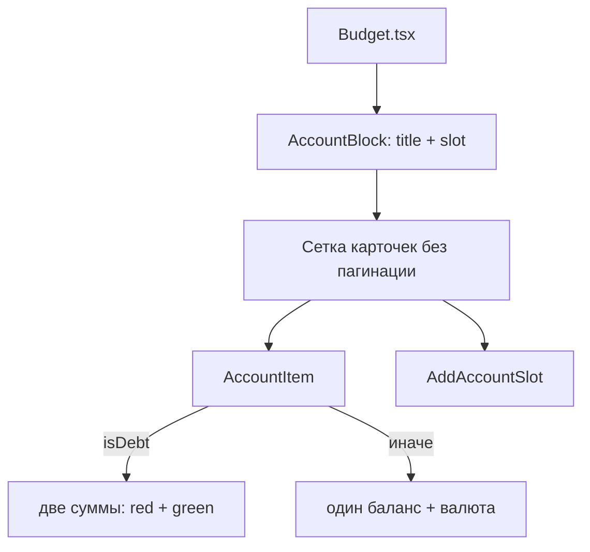

# US-010: Нарисовать карточки счетов

**История:** priority 10, `passes: false`. Ссылок на Figma нет (`designReference: []`).

**Вне скоупа:** пагинация Income/Current (US-011) и Expense (US-012) — без свайпа, точек, стрелок и `ResizeObserver`; `MonthPickerInput` (US-013); итоги бара (US-014); пикер иконок и полный каталог (US-015); модалка создания (US-016); клик по карточке → детали (US-018); DnD и Edit (US-027); конвертация в основную валюту (карточки остаются в валюте счёта); правки `src/api`; хук `useBudgetAccounts`.

## Контекст

US-009 уже дал каркас: `Budget` заполняет `AppLayout` `main`, `ParametersBar`-заглушка, три `AccountBlock` (`flex: 1`, `min-height: 0`). В слоте пока список имён. Модель `BudgetAccount` уже есть: `icon`/`color` — `string | null`, у долга `debtAmount`/`paidAmount`.

PRD §1.2.1 / 1.3.1 / 1.4.1: карточка — имя (с `…` при переполнении), иконка, цвет, баланс, валюта. У debt вместо одного баланса — сумма долга красным и оплачено зелёным. «Add account» — последний элемент блока, того же размера, что карточка.

Learnings: UI-фолбэк Wallet / `#4C6EF5`, если appearance нет — здесь, не в маппере. Карточки в валюте счёта, не через `convertToPrimary`. Vitest — `*.test.ts` + `environment: 'node'`, компонентных тестов нет. Строки — `useTranslation()` + `src/i18n/en.ts`. CSS module рядом с компонентом.

Сейчас:

- [`src/modules/budget/components/AccountBlock/AccountBlock.tsx`](src/modules/budget/components/AccountBlock/AccountBlock.tsx) — `<ul>` имён в слоте
- [`src/modules/budget/types/budgetAccount.ts`](src/modules/budget/types/budgetAccount.ts) — `icon`/`color` могут быть `null`; `isDebt` + `debtAmount`/`paidAmount`
- Иконки Phosphor: ключ в preference **без** суффикса `Icon` (`'Wallet'` → `WalletIcon`), как в футере [`AppLayout/constants.ts`](src/components/AppLayout/constants.ts)
- Роутер — `HashRouter`: `/#/monetta/budget`

## Шаги

### 1. UI-дефолты appearance и резолвер иконки

В [`src/modules/budget/constants.ts`](src/modules/budget/constants.ts) добавить только UI-константы (маппер не трогать, `icon`/`color` в модели остаются `null`):

- `DEFAULT_ACCOUNT_ICON = 'Wallet'`
- `DEFAULT_ACCOUNT_COLOR = '#4C6EF5'` (Mantine indigo, как в US-007)

Резолвер иконки — рядом с UI, не в data-helpers (helpers модуля не импортируют `@phosphor-icons/react`):

- Вход: `string | null` (ключ Phosphor без `Icon`)
- Собрать имя компонента `${name}Icon`, взять из `@phosphor-icons/react`
- Нет имени, неизвестное имя или это не компонент → `WalletIcon`

Полный каталог иконок для пикера не заводить — это US-015. Резолвер должен пережить любой валидный ключ из preference.

### 2. `AccountItem`

Новый компонент [`src/modules/budget/components/AccountItem/AccountItem.tsx`](src/modules/budget/components/AccountItem/AccountItem.tsx) + `AccountItem.module.css`.

Проп: `account: BudgetAccount`. Клик и модалка деталей **не** вешать.

Карточка:

| Поле | Поведение |
| --- | --- |
| Имя | `account.name` как есть (с Firefly, не i18n); `overflow: hidden; text-overflow: ellipsis; white-space: nowrap` |
| Иконка | Phosphor из резолвера; `size` как в футере (~24) или чуть больше, чтобы читалось на карточке |
| Цвет | `account.color ?? DEFAULT_ACCOUNT_COLOR` на иконке (и при желании тонкий акцент карточки). Не писать preference |
| Баланс | обычный счёт: одно число `account.balance` |
| Валюта | `currencySymbol` рядом с суммой, иначе `currencyCode`. Не конвертировать в primary |
| Debt | **не** рисовать `balance`. Две строки: `debtAmount` цветом `var(--mantine-color-red-6)` (или Mantine `c="red"`), `paidAmount` — `var(--mantine-color-green-6)`. Из‑за второй строки карточка выше, чем Income/Current |

Формат суммы — маленький чистый helper в `src/modules/budget/helpers` (например `formatAccountAmount`): число + символ/код. Без округления через курсы. Если вынести helper — покрыть Vitest; компонентный тест не писать.

Разметка: CSS module, токены `--mantine-spacing-*` / `--mantine-color-*` / `--mantine-radius-*`. Не `Paper`/`Card` Mantine, если достаточно div (как Login/AccountBlock). Не делать карточку `button`, пока нет US-018.

Высота:

- Базовая карточка (Income, Current, обычный Expense) — одна строка суммы, одинаковый `min-height`
- `.debt` — две строки суммы, выше базовой. Этот `min-height` — эталон для Add в Expense

### 3. Слот Add account

Новый [`src/modules/budget/components/AddAccountSlot/AddAccountSlot.tsx`](src/modules/budget/components/AddAccountSlot/AddAccountSlot.tsx) + CSS рядом.

- Последний элемент списка в слоте блока
- Визуально кнопка с `Plus` (Phosphor) и доступным именем `t('budget.addAccount')` → `'Add account'`
- **Без** `onClick` / модалки (US-016)
- Высота: Income и Current — как базовая карточка; Expense — как Debt (`min-height` той же величины, даже если в блоке ещё нет долгов)
- Проп `type: AccountType` (или `tall?: boolean` только для Expense)

Не сортировать слот, не включать его в данные Query.

### 4. Вставить карточки в `AccountBlock`

В [`AccountBlock`](src/modules/budget/components/AccountBlock/AccountBlock.tsx) заменить `<ul>` имён:

- Сетка в `.slot`: `display: grid; grid-template-columns: repeat(4, minmax(0, 1fr)); gap: …`
- Все счета блока + Add последним. Лишние ряды пока просто переносятся; слот уже `overflow: auto` — этого достаточно до US-011
- Не считать страницы, не мерить ширину, не добавлять точки/свайп/стрелки, не `@media (min-width: 961px)` под «сколько влезет»

`Budget.tsx` и `useBudgetAccounts` не менять, кроме того что блоки уже получают `accounts`. Ветку `!data` не трогать.

### 5. Стили и i18n

- CSS modules только рядом с `AccountItem`, `AddAccountSlot`, правки `AccountBlock.module.css` (убрать `.names`)
- Новые строки только в [`src/i18n/en.ts`](src/i18n/en.ts): `budget.addAccount`. Подписи «Debt»/«Paid» на карточке не нужны, если PRD показывает только окрашенные суммы
- Тёмную тему, футер, Query persist, ParametersBar не трогать

Тесты: история не требует новых. Существующие тесты маппера/хука не ломать. Если появится `formatAccountAmount` — `src/modules/budget/tests/formatAccountAmount.test.ts`.

## Проверка

1. **`npm test`** — существующие тесты зелёные (и новые helper-тесты, если добавлены).
2. **`npx tsc -b --pretty false`** — без ошибок; неизвестные i18n-ключи падают на typecheck.
3. **`npm run lint`** — без новых замечаний в файлах истории.
4. **Браузер** (agent-browser MCP), `HashRouter`: `/#/monetta/login` → `/#/monetta/budget`. Dev-сервер — Vite `strictPort` (часто 5175).

Чеклист в браузере:

- В каждом блоке вместо голых имён — карточки: обрезанное длинное имя, иконка, цвет, баланс и валюта счёта (не primary)
- Счета без preference: иконка Wallet, цвет `#4C6EF5`
- Liability/debt в Expense: две суммы — долг красным, оплачено зелёным; карточка выше, чем Income/Current
- Обычный expense: один баланс, как Income/Current
- В конце каждого блока слот Add account той же высоты, что карточки блока; в Expense слот высокий, как Debt
- Клик по карточке и по Add **не** открывает модалки
- Нет точек пагинации, стрелок и свайпа страниц
- Loading / ошибка при `!data` по-прежнему без бара и карточек
- History / Analytics / Settings и футер не сломаны
- Мобилка и ширина ≥961px: карточки читаются, колонка Budget по-прежнему над футером

Готово, когда карточки и Add видны, typecheck проходит, пагинация и модалки ещё не начаты.
