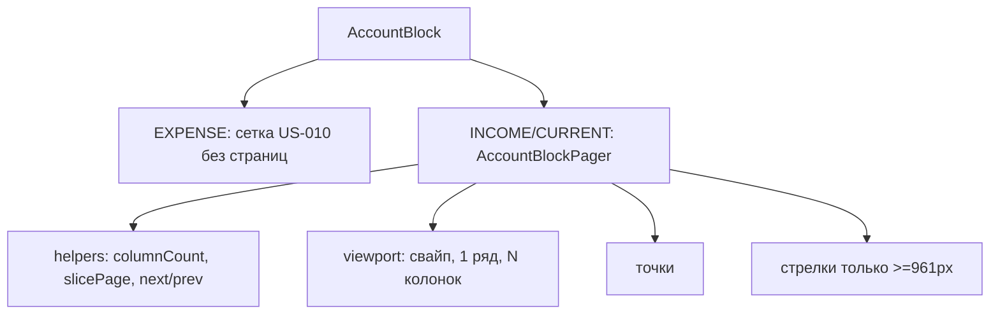

# US-011: Пагинировать блоки Income и Current

**История:** priority 11, `passes: false`. Ссылок на Figma нет (`designReference: []`).

**Вне скоупа:** пагинация Expense по высоте (`ResizeObserver` / несколько рядов `1fr`) — US-012; `MonthPickerInput` (US-013); итоги бара (US-014); модалка создания и `onClick` у Add (US-016); клик по карточке (US-018); DnD и Edit, выключение свайпа во время драга (US-027/028); карусель / Embla / Mantine Carousel; правки `src/api`; хук `useBudgetAccounts`.

## Контекст

US-010 уже рисует карточки и Add в 4-колоночной сетке; лишние ряды переносятся, слот `overflow: auto`. FR-8 / resolved questions: **paged CSS grid, не карусель**. Income и Current — **один ряд**. Точки на мобилке и десктопе. Свайп с последней страницы справа налево открывает первую.

PRD §1.2 / §1.3: на мобилке 4 счёта на страницу, свайп, точки; десктоп с **961px** — стрелки и столько карточек, сколько влезает в один ряд. Add — последний элемент списка, того же размера, что карточка (может оказаться один на последней странице).

Learnings: Vitest — `*.test.ts` + `environment: 'node'`, компонентных тестов нет. Строки — `useTranslation()` + `src/i18n/en.ts`. CSS module рядом с компонентом. Брейкпоинт **961px свой**, не Mantine `md`/`lg` (`62em`/`75em`). Роутер — `HashRouter`: `/#/monetta/budget`. Vite `strictPort` **5175**. `@mantine/hooks` уже в зависимостях.

Сейчас:

- [`AccountBlock.tsx`](src/modules/budget/components/AccountBlock/AccountBlock.tsx) — все типы: `repeat(4, minmax(0, 1fr))`, счета + Add, без страниц
- [`AccountBlock.module.css`](src/modules/budget/components/AccountBlock/AccountBlock.module.css) — `.slot { overflow: auto }`; Expense `--account-card-min-height: 7.5rem`
- [`Budget.tsx`](src/modules/budget/Budget.tsx) — три блока из `data[type]`, не менять кроме пропсов, если не понадобится
- Карточки и Add не трогать (высота, иконки, формат сумм)



## Шаги

### 1. Чистая математика страниц

Новый helper [`src/modules/budget/helpers/accountBlockPaging.ts`](src/modules/budget/helpers/accountBlockPaging.ts) (без React и Phosphor). Константы — в [`src/modules/budget/constants.ts`](src/modules/budget/constants.ts):

- `ACCOUNT_BLOCK_DESKTOP_MIN_PX = 961` — desktop `>= 961`, mobile `< 961`
- `ACCOUNT_BLOCK_MOBILE_COLUMNS = 4`
- `ACCOUNT_CARD_MIN_WIDTH_PX` — нижняя ширина карточки, чтобы на десктопе считать «сколько влезает». Ориентир: плотность 4 колонок на узком экране (~72–88px), не уже мобильной карточки. Зафиксировать одним числом, не читать DOM в helper.
- `ACCOUNT_GRID_GAP_PX` — как `var(--mantine-spacing-xs)` (обычно 10). Передавать в `columnCount`, не парсить CSS в тестах.

Функции:

| Функция | Поведение |
| --- | --- |
| `pageCount(itemCount, pageSize)` | `max(1, ceil(itemCount / pageSize))` при `itemCount > 0`; `pageSize < 1` не допускать (кламп к 1) |
| `slicePage(items, pageIndex, pageSize)` | срез одной страницы; `pageIndex` клампить в `[0, pageCount-1]` |
| `columnCount({ isDesktop, containerWidth })` | мобилка → всегда 4; десктоп → `max(1, floor((width + gap) / (minWidth + gap)))`; `width <= 0` (ещё не измерили) → 4, без вспышки в 1 колонку |
| `nextPageIndex(page, pageCount)` | `page + 1`, **с последней на 0** (wrap) |
| `prevPageIndex(page)` | `max(0, page - 1)` — **без** wrap первой на последнюю (в ТЗ этого нет, не выдумывать) |
| `clampPageIndex(page, pageCount)` | после ресайза / смены `pageSize` |

`itemCount` для сетки = `accounts.length + 1` (слот Add всегда в списке). Не класть Add в данные Query.

Тесты: [`src/modules/budget/tests/accountBlockPaging.test.ts`](src/modules/budget/tests/accountBlockPaging.test.ts).

Примеры, которые обязательно покрыть:

- 0 счетов + Add → 1 страница, на ней только Add
- 3 счета + Add, pageSize 4 → 1 страница, 4 слота
- 4 счета + Add, pageSize 4 → 2 страницы; вторая — только Add
- десктоп `columnCount` растёт с шириной; узкий контейнер не даёт 0 колонок
- `nextPageIndex` с последней → 0
- `prevPageIndex(0)` → 0
- `slicePage` при `pageIndex` больше последней возвращает последнюю страницу

История формально не требует тестов, но вся логика — чистые функции; US-012 возьмёт тот же `pageSize = columns * rows`.

### 2. `AccountBlockPager` — UI одного ряда

Новый [`src/modules/budget/components/AccountBlockPager/AccountBlockPager.tsx`](src/modules/budget/components/AccountBlockPager/AccountBlockPager.tsx) + CSS рядом. Не тащить это в гигантский `AccountBlock`.

Пропсы: `accounts: BudgetAccount[]` (и при необходимости `gridClassName` для токена высоты — у Income/Current остаётся 6rem). Add рендерить **внутри** пейджера последним элементом списка, как сейчас в блоке.

Разметка:

```
[ стрелка назад ] [ viewport с ul.grid на 1 ряд ] [ стрелка вперёд ]
                    [ точки ]
```

- **Один ряд:** `grid-template-columns: repeat(N, minmax(0, 1fr))`, `grid-template-rows: 1fr` / без авто-рядов. Не `auto-fill`: иначе 1 карточка на последней странице растянется на всю ширину. `N` = текущий `pageSize`, даже если на странице меньше элементов — Add один на последней странице занимает **одну** ячейку слева, не всю ширину.
- Viewport: `flex: 1; min-width: 0; overflow: hidden`. Скролл слота выключить — страницы меняет жест/стрелка, не overflow.
- Ширину мерить у **viewport** (не у ряда со стрелками), иначе стрелки уменьшат «сколько влезает». `@mantine/hooks`: `useElementSize` на viewport; `useMediaQuery(\`(min-width: ${ACCOUNT_BLOCK_DESKTOP_MIN_PX}px)\`)`. Карусель Mantine не подключать.
- Стрелки: только при `isDesktop` **и** `pageCount > 1`. Phosphor `CaretLeft` / `CaretRight`, нативные `<button>`, не `Paper`. Вперёд = `nextPageIndex` (wrap), назад = `prevPageIndex`. На мобилке стрелок нет, только свайп + точки.
- Точки: под рядом на мобилке **и** десктопе; по одной на страницу; текущая подсвечена (`aria-current`). Одна страница — одна точка (пустое состояние с одним Add). Клик по точке не обязателен по ТЗ; если делать кнопками — только переключение `pageIndex`, без новой математики.
- Свайп: pointer events на viewport (не Embla). Порог ~40–50px по X; вертикаль доминирует — игнор. Вперёд (палец влево / `deltaX < 0`) → `nextPageIndex` с wrap последняя→первая. Назад → `prevPageIndex`. После свайпа не открывать клик. `touch-action: pan-y` или `none` на viewport, чтобы горизонтальный жест не уходил в навигацию браузера. Анимацию слайда не требовать: смена среза страницы достаточна (модель `pageIndex` нужна US-028).
- Состояние `pageIndex` — локально **на блок** (Income и Current независимы). При смене `pageSize` — `clampPageIndex`. Не писать в preferences / URL.
- a11y: `aria-label` у стрелок и у контейнера точек через i18n (`budget.pagination.previous` / `next` / `pages`).

Не подключать `@dnd-kit`. Не выключать свайп «на будущее» для Edit.

### 3. Вставить в `AccountBlock`

В [`AccountBlock`](src/modules/budget/components/AccountBlock/AccountBlock.tsx):

- `type === EXPENSE` — **как сейчас**: 4 колонки, wrap рядов, Add последним, `overflow: auto`, токен 7.5rem. Без точек, свайпа, стрелок, без измерения ширины.
- `INCOME` | `CURRENT` — `AccountBlockPager` вместо голой сетки.

`Budget.tsx` и `useBudgetAccounts` не менять. Ветку `!data` не трогать. `AddAccountButton` по-прежнему без `onClick` и без `type`.

`.slot` у пагинируемых блоков: `overflow: hidden`, чтобы свайп не скроллил сетку. У Expense слот оставить `overflow: auto`.

### 4. Стили и i18n

- CSS только рядом с пейджером + правки `AccountBlock.module.css`.
- Новые строки только в [`src/i18n/en.ts`](src/i18n/en.ts): `budget.pagination.previous` → `Previous page`, `next` → `Next page`, подпись точек при необходимости. Видимого «Page 1 of 3» на экране нет.
- Тёмную тему, футер, Query persist, ParametersBar, карточки, формат сумм не трогать.

## Проверка

1. **`npm test`** — новые тесты paging зелёные, старые не сломаны.
2. **`npx tsc -b --pretty false`** — без ошибок; неизвестные i18n-ключи падают на typecheck.
3. **`npm run lint`** — без новых замечаний в файлах истории.
4. **Браузер** (agent-browser MCP / cursor-ide-browser), `HashRouter`: `/#/monetta/login` → `/#/monetta/budget`. Dev-сервер Vite **5175** (`strictPort`).

Чеклист в браузере:

- **Мобилка (<961px), Income и Current:** ровно **один ряд**, до 4 ячеек на страницу; свайп листает; точки под рядом, текущая подсвечена
- 4 счёта в блоке: страница 1 — четыре карточки, страница 2 — только Add (не растянут на всю ширину)
- 3 счёта: одна страница — три карточки + Add
- Свайп справа налево **с последней** страницы открывает **первую**; свайп налево направо с первой **не** прыгает на последнюю
- Стрелок на мобилке нет
- **Десктоп (≥961px):** один ряд; число карточек растёт с шириной viewport (не всегда 4); стрелки назад/вперёд и свайп; точки тоже видны
- Ресайз окна клампит страницу, ряд не переносится на две линии
- **Expense:** без точек/стрелок/свайпа страниц; лишние ряды как сейчас (wrap + скролл слота); карточки Debt по-прежнему выше
- Клик по карточке и Add по-прежнему не открывает модалки
- Loading / ошибка при `!data` без бара и сеток
- History / Analytics / Settings и футер на месте
- Narrow и ≥961px: колонка Budget над футером, блоки не выталкивают футер

Готово, когда Income/Current листаются страницами в один ряд, Expense ещё не пагинирован по высоте, typecheck зелёный.
