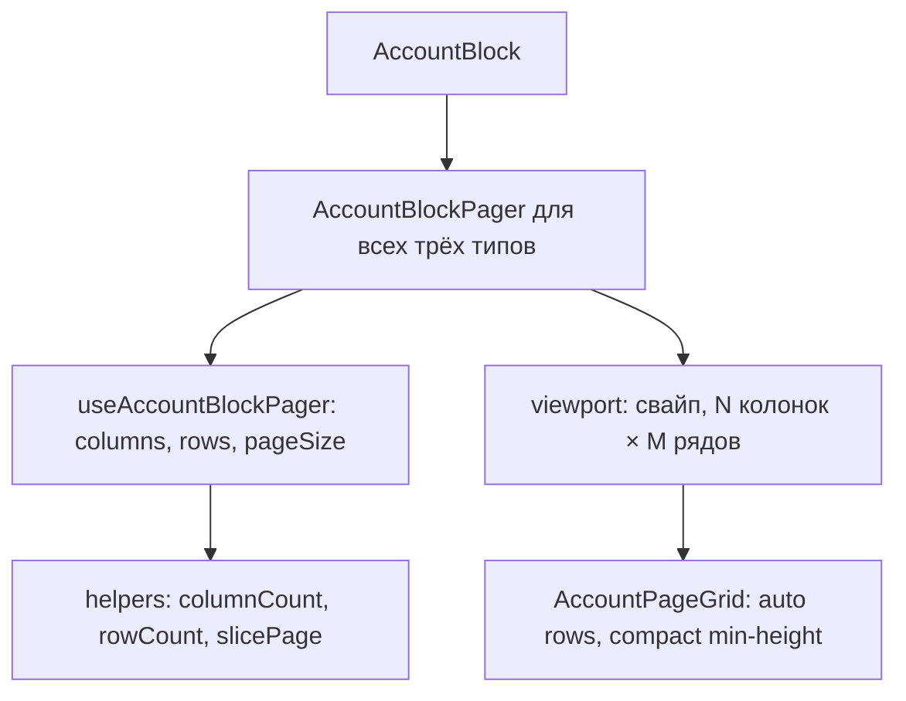

# US-012: Пагинировать блок Expense по оставшейся высоте

**История:** priority 12, `passes: false`. Ссылок на Figma нет (`designReference: []`).

**Вне скоупа:** `MonthPickerInput` (US-013); итоги бара (US-014); модалка создания и `onClick` у Add (US-016); клик по карточке (US-018); DnD и Edit, выключение свайпа во время драга (US-027/028); третья разметка / второй пейджер / Embla / Mantine Carousel; правки `src/api`; хук `useBudgetAccounts`; смена высоты карточек Income/Current (6rem) и токена Expense (7.5rem).

## Контекст

US-011 уже дал paged CSS grid (не карусель) для Income и Current: один ряд, свайп, точки, на десктопе ≥961px ещё стрелки, wrap последняя→первая и первая→последняя. Expense пока рисует ту же `AccountPageGrid` без пейджера, слот `overflow: auto`, лишние ряды скроллятся.

PRD §1.4: в Expense столько рядов, сколько влезает **до футера**, место под точки зарезервировано снизу; на мобилке 4 колонки; на десктопе (≥961px) — столько карточек, сколько влезает в доступную площадь; стрелки; Add — последний слот того же размера.

Resolved questions: компактные ряды по min-height карточки (не 1fr); точки на мобилке и десктопе; свайп с последней страницы справа налево → первая.

Learnings US-011 review: **обернуть ту же сетку в тот же пейджер** с `pageSize = columns * rows`, не плодить третью разметку. `useElementSize` уже на viewport (ширина). Брейкпоинт **961px свой**. Vitest — `*.test.ts` + `environment: 'node'`, компонентных тестов нет. Роутер — `HashRouter`: `/#/monetta/budget`. Vite **5175** (`strictPort`). i18n пагинации уже есть (`budget.pagination.*`).

Сейчас:

- [`AccountBlock.tsx`](src/modules/budget/components/AccountBlock/AccountBlock.tsx) — `EXPENSE` → голая сетка в `.slot`; иначе `AccountBlockPager`
- [`useAccountBlockPager.ts`](src/modules/budget/components/AccountBlock/AccountBlockPager/useAccountBlockPager.ts) — `pageSize` = `columns`, рядов нет; из `useElementSize` берётся только `width`
- [`AccountBlockViewport.tsx`](src/modules/budget/components/AccountBlock/AccountBlockPager/AccountBlockViewport/AccountBlockViewport.tsx) — `slicePage(..., columns)` и `pageCount(..., columns)`
- [`AccountPageGrid`](src/modules/budget/components/AccountBlock/AccountPageGrid/AccountPageGrid.tsx) — `grid-template-rows: auto`; `minHeight` уже проп
- [`AccountBlockPager.module.css`](src/modules/budget/components/AccountBlock/AccountBlockPager/AccountBlockPager.module.css) — `.row { flex-shrink: 0 }` (ряд по контенту — ок для одного ряда, **не** ок для Expense)
- Три `AccountBlock` в Budget уже `flex: 1; min-height: 0`; футер снаружи страницы. Мерить нужно **слот сетки Expense над точками**, не весь экран до футера.

## Шаги

### 1. Чистая математика рядов

В [`accountBlockPaging.ts`](src/modules/budget/helpers/accountBlockPaging.ts) добавить `rowCount` по той же формуле, что `columnCount` (без React и Phosphor).

В [`constants.ts`](src/modules/budget/constants.ts) — числовой минимум высоты Debt-карточки для формулы, рядом с уже существующим `'7.5rem'`. Зафиксировать одним числом (как `ACCOUNT_CARD_MIN_WIDTH_PX`), не читать DOM в helper. Ориентир: `7.5rem` при 16px = **120**. Gap — уже `ACCOUNT_GRID_GAP_PX` (10). Не парсить CSS в тестах.

| Функция | Поведение |
| --- | --- |
| `rowCount({ availableHeight, minCardHeight, gap })` | `max(1, floor((availableHeight + gap) / (minCardHeight + gap)))`; `availableHeight <= 0` (ещё не измерили) → **1**, без вспышки в 0 рядов |
| `pageSize` | `columns * rows` — в хуке, не отдельный хелпер, если это просто умножение |

Мобилка и десктоп считают ряды **одинаково из высоты**. `isDesktop` на ряды не влияет: колонки по-прежнему 4 на мобилке и из ширины на десктопе.

`itemCount` = `accounts.length + 1` (Add всегда в списке). Не класть Add в Query.

Тесты в [`accountBlockPaging.test.ts`](src/modules/budget/helpers/tests/accountBlockPaging.test.ts) — обязательные примеры:

- высота 0 → 1 ряд
- слишком мало места на одну карточку → всё равно 1 ряд
- minHeight 120, gap 10, высота 250 → 2 ряда (`floor((250+10)/(120+10)) = 2`)
- 7 счетов + Add, pageSize 8 (4×2) → 1 страница
- 8 счетов + Add, pageSize 8 → 2 страницы; вторая — только Add
- `slicePage` при pageSize 8 отдаёт первую восьмёрку / хвост с Add
- десктоп: ширина 890 → 10 колонок **и** высота 250 → 2 ряда независимо (pageSize 20)

`nextPageIndex` / `prevPageIndex` / wrap не менять — уже зациклены в обе стороны.

### 2. Обобщить пейджер: `fillHeight` + `rows`

Не заводить `ExpensePager`. Расширить существующие `AccountBlockPager` / `useAccountBlockPager` / `AccountBlockViewport` / `AccountPageGrid`.

Пропсы пейджера (без `AccountType` внутри пейджера):

- `accounts`
- `minHeight` — CSS-токен ряда (`ACCOUNT_CARD_MIN_HEIGHT_DEFAULT` или `ACCOUNT_CARD_MIN_HEIGHT_EXPENSE`)
- `fillHeight` — `true` только у Expense

Хук:

- как сейчас: `useMediaQuery` 961px, `useElementSize` на **viewport** (не на ряд со стрелками)
- брать и `width`, и `height`
- `columns = columnCount({ isDesktop, containerWidth: width })`
- `rows = fillHeight ? rowCount({ availableHeight: height, minCardHeight: … }) : 1`
- `pageSize = columns * rows`
- `totalPages = pageCount(items.length, pageSize)`; `currentPage` клампить как сейчас
- `showArrows` без изменений: десктоп и `totalPages > 1`

Viewport:

- `slicePage` / `pageCount` внутри слайдов — по **`pageSize`**, не по `columns`
- в `AccountPageGrid` передать `columns` и `minHeight`. `fillHeight` растягивает только viewport для замера, не ряды сетки.
- свайп, loop, rubber-band, handle стрелок/точек **не трогать**

Сетка:

- `grid-template-columns: repeat(N, minmax(0, 1fr))` как сейчас
- `grid-template-rows: auto` у всех блоков: ряды по min-height карточки; `column-gap` — `--mantine-spacing-xs` / `ACCOUNT_GRID_GAP_PX` (10); `row-gap` — 0 / `ACCOUNT_GRID_ROW_GAP_PX` (между рядами хватает padding карточки). Свободная высота viewport не распределяется через `1fr`. Видимых заголовков Income / Current / Expense нет (`aria-label` на секции).
- неполный последний ряд: пустых ячеек не рисовать (как сейчас — только реальные items). Одинокий Add занимает **одну** ячейку слева, не всю ширину. `auto-fill` не использовать

Слайды карусели при `fillHeight` должны растягиваться на высоту viewport (`.viewport` / `.track` / `.slide` → `height: 100%`, `min-height: 0`). Без `fillHeight` высоту от контента не ломать.

### 3. Вёрстка Expense: мерить область над точками

Точки уже **под** рядом — это и есть «место под точки». Менять их местами не нужно.

Чтобы `height` viewport был **доступной** высотой, а не высотой контента:

- у пейджера с `fillHeight` ряд со стрелками+viewport: `flex: 1; min-height: 0` (не `flex-shrink: 0`)
- точки `flex-shrink: 0` под рядом
- `.pager` уже `flex: 1; min-height: 0` — этого достаточно, чтобы заполнить `AccountBlock`
- слот `.slot { overflow: auto }` у Expense **убрать**: страницы листает жест, не скролл сетки

В [`AccountBlock.tsx`](src/modules/budget/components/AccountBlock/AccountBlock.tsx) все три типа через пейджер:

- Income/Current: `fillHeight={false}`, `minHeight={ACCOUNT_CARD_MIN_HEIGHT_DEFAULT}` (поведение US-011)
- Expense: `fillHeight`, `minHeight={ACCOUNT_CARD_MIN_HEIGHT_EXPENSE}`

`Budget.tsx` и `useBudgetAccounts` не менять. `AddAccountButton` без `onClick` и без `type`. Карточки не растягивать: ряды остаются по `min-height` токена.

Куриный-яичный цикл: родитель (`AccountBlock` → pager → row) имеет определённую flex-высоту; viewport заполняет остаток; `useElementSize` читает эту высоту; `rowCount` считает, сколько min-height карточек влезает; сетка рисует столько рядов компактно. Не измерять высоту самой сетки карточек как «доступную».

### 4. Стили и i18n

- CSS только рядом с пейджером / viewport / grid + удаление неиспользуемого `.slot` в `AccountBlock.module.css`, если ветка Expense исчезнет
- Новых пользовательских строк не нужно: `budget.pagination.previous` / `next` / `pages` / `page` уже есть
- Тёмную тему, футер, Query persist, ParametersBar, формат сумм, каталог иконок не трогать
- Не подключать `@dnd-kit`. Не выключать свайп «на будущее» для Edit

## Проверка

1. **`npm test`** — новые тесты `rowCount` / pageSize зелёные; тесты US-011 (колонки, wrap, rubber-band) не сломаны.
2. **`npx tsc -b --pretty false`** — без ошибок.
3. **`npm run lint`** — без новых замечаний в файлах истории.
4. **Браузер** (cursor-ide-browser / agent-browser), `HashRouter`: `/#/monetta/login` → `/#/monetta/budget`. Dev-сервер Vite **5175**.

Чеклист в браузере:

- **Expense, мобилка (<961px):** 4 колонки; рядов `max(1, floor((availableHeight + gap) / (minCardHeight + gap)))`; ряды компактные по min-height, gap как у сетки; точки под сеткой, текущая подсвечена; стрелок нет; свайп листает
- Сетка Expense **не скроллится** внутри слота; лишние счета на следующих страницах
- Место под точки есть: футер не перекрывает точки, точки не наезжают на карточки
- 8 счетов на странице 4×2: страница 1 — восемь карточек, страница 2 — только Add (одна ячейка, не на всю ширину)
- Свайп справа налево **с последней** → **первая**; с первой налево направо → последняя (как в US-011)
- **Expense, десктоп (≥961px):** колонки растут с шириной; ряды — с высотой области над точками; стрелки + свайп + точки
- Ресайз окна (ширина и высота) пересчитывает `pageSize` и клампит страницу; ряды остаются компактными
- **Income и Current без регрессии:** один ряд; на мобилке 4 колонки; на десктопе колонки из ширины; точки; стрелки только ≥961px и при нескольких страницах
- Клик по карточке и Add по-прежнему не открывает модалки
- Loading / ошибка при `!data` без бара и сеток
- History / Analytics / Settings и футер на месте; блоки Budget не выталкивают футер
- Карточки Debt по-прежнему с двумя суммами; все плитки Expense не ниже 7.5rem

Готово, когда Expense листается страницами по оставшейся высоте теми же контролами, что Income/Current, typecheck зелёный.
