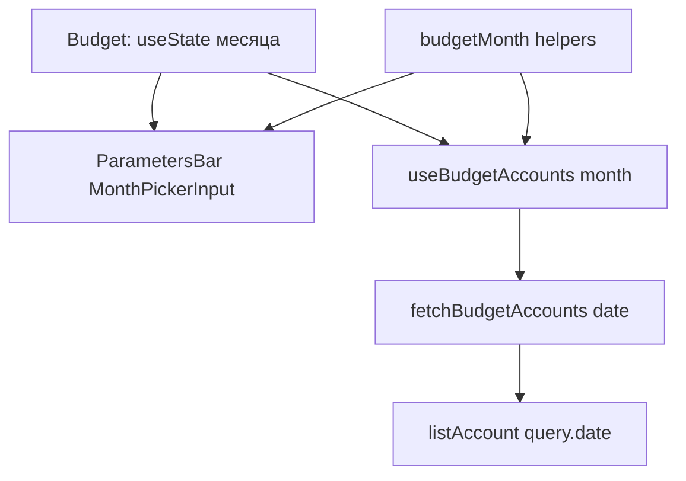

# US-013: выбор месяца в parameters bar

**История:** [US-013](current-task/feature.json) — priority 13, `passes: false`. Figma нет (`designReference: []`).

**Перед работой:** в [feature.json](current-task/feature.json) у US-012 поставить `"passes": true`.

**Вне скоупа:** итоги Income/Expenses/Balance (US-014); модалки транзакций (US-024+); Edit/DnD (US-027); DatesProvider с русской локалью; Chart.js; правки `src/api`.

## Контекст

Сейчас слот Month в [`ParametersBar.tsx`](src/modules/budget/components/ParametersBar/ParametersBar.tsx) — только подпись `budget.parameters.month`. Счета грузятся без даты: [`fetchBudgetAccounts`](src/modules/budget/helpers/fetchBudgetAccounts.ts) вызывает `listAccount({ query: { page, limit } })`, ключ `['budget', 'accounts']`.

Learnings US-008: не передавать `type` в `listAccount`; **дату не передавали, пока не будет US-013**. Карточки читают `current_balance` — Firefly отдаёт баланс **на день** из query `date` (`YYYY-MM-DD`).

PRD §1.1.4: month picker с переключением года, будущие месяцы нельзя. Дата транзакции (US-024): сегодня, если выбран текущий месяц Budget, иначе первый день выбранного месяца.

Mantine 9 (`@mantine/dates` уже в зависимостях): значение — **строка** `YYYY-MM-DD` или `null`, не `Date`. Стили: `@mantine/dates/styles.css` **после** `@mantine/core/styles.css` в [`App.tsx`](src/App.tsx) (сейчас dates CSS нет). `maxDate` принимает `Date` или строку. `DatesProvider` для английского V1 не нужен.

## Архитектура

Месяц живёт в [`Budget.tsx`](src/modules/budget/Budget.tsx) (`useState`), не только внутри бара: его читают query счетов и позже US-014/US-024. Контекст не заводить, пока модалки не существуют.

## Шаги

### 1. Чистые хелперы месяца

Новый [`src/modules/budget/helpers/budgetMonth.ts`](src/modules/budget/helpers/budgetMonth.ts) + тесты в [`helpers/tests/budgetMonth.test.ts`](src/modules/budget/helpers/tests/budgetMonth.test.ts). `today` / `now` передавать аргументом, не читать `new Date()` внутри формул (Vitest `node`).

- `startOfMonth(isoDate)` → `YYYY-MM-01`
- `currentMonthStart(today)` → первый день текущего месяца
- `fireflyBalanceDate({ month, today })`: текущий месяц → `today`; прошлый → последний день месяца; если месяц в будущем (не должен дойти из UI) → `today`
- `defaultTransactionDate({ month, today })`: текущий месяц → `today`; иначе первый день месяца (для US-024, в UI транзакций не подключать)
- `isFutureMonth` / сравнение для `maxDate`

dayjs уже в проекте — ок в этом helper. Phosphor и React не импортировать.

### 2. Query счетов с `date`

- `fetchBudgetAccounts(date: string)` передаёт в `listAccount` `{ page, limit, date }`. **`type` по-прежнему не передавать.**
- Ключ: префикс `BUDGET_ACCOUNTS_QUERY_KEY` (`['budget', 'accounts']`) оставить для будущих `invalidateQueries`; фактический ключ `['budget', 'accounts', date]`.
- [`useBudgetAccounts(month)`](src/modules/budget/hooks/useBudgetAccounts.ts) кладёт в ключ `fireflyBalanceDate` выбранного месяца.

Обновить [`fetchBudgetAccounts.test.ts`](src/modules/budget/helpers/tests/fetchBudgetAccounts.test.ts): вызов с датой, в query есть `date`.

### 3. MonthPickerInput в parameters bar

В слоте Month вместо голого `Text`:

- `MonthPickerInput` из `@mantine/dates`, `type` по умолчанию (один месяц)
- `label={t('budget.parameters.month')}` — отдельный `Text` над пустым слотом убрать, чтобы не дублировать
- controlled `value: string` (старт — `currentMonthStart`)
- `onChange`: игнорировать `null` (контрол не `clearable`)
- `maxDate` — сегодня / конец текущего месяца, чтобы будущие месяцы были disabled
- `valueFormat` вроде `MMM YYYY` (en, как в Analytics «Jan - Aug 2026»)
- `size="sm"` рядом с кнопкой Edit
- кнопка Edit — заглушка, не трогать; плейсхолдеры сумм — US-014

Пропсы бара: `month` + `onMonthChange`. Стили только в [`ParametersBar.module.css`](src/modules/budget/components/ParametersBar/ParametersBar.module.css).

В `App.tsx`: `import '@mantine/dates/styles.css'` сразу после core styles.

### 4. Budget: бар не прятать за `!data`

Месяц — вход query. Пока `!data`, **оставить ParametersBar** (picker + плейсхолдеры + Edit), статус загрузки/ошибки — вместо блоков счетов. Иначе смена месяца на refetch уберёт сам picker (сейчас весь page без бара при `!data`).

`useState` месяца инициализировать текущим месяцем, не persist в localStorage.

## Проверка

1. **`npm test`** — `budgetMonth` + обновлённый `fetchBudgetAccounts`; старые тесты paging/mapping зелёные.
2. **`npx tsc -b --pretty false`**
3. **`npm run lint`**
4. **Браузер**, Vite **5175**, `/#/monetta/login` → `/#/monetta/budget`.

Чеклист в браузере:

- В parameters bar есть MonthPickerInput: месяц и год в одном контроле, подпись Month
- Старт — текущий месяц; dropdown стилизован (dates CSS подключены)
- Будущие месяцы выключены; прошлые и другие годы доступны
- Смена месяца перезапрашивает счета (балансы карточек as-of); persist-кеш другого месяца, если был, показывается сразу
- Во время refetch бар с picker остаётся на месте
- Income/Current/Expense пагинация без регрессии; Edit и плейсхолдеры сумм на месте
- Клик по карточке/Add модалки не открывает

Готово, когда месяц выбирается без будущих дат, счета грузятся с Firefly `date`, typecheck зелёный, `"passes": true` у US-013.
