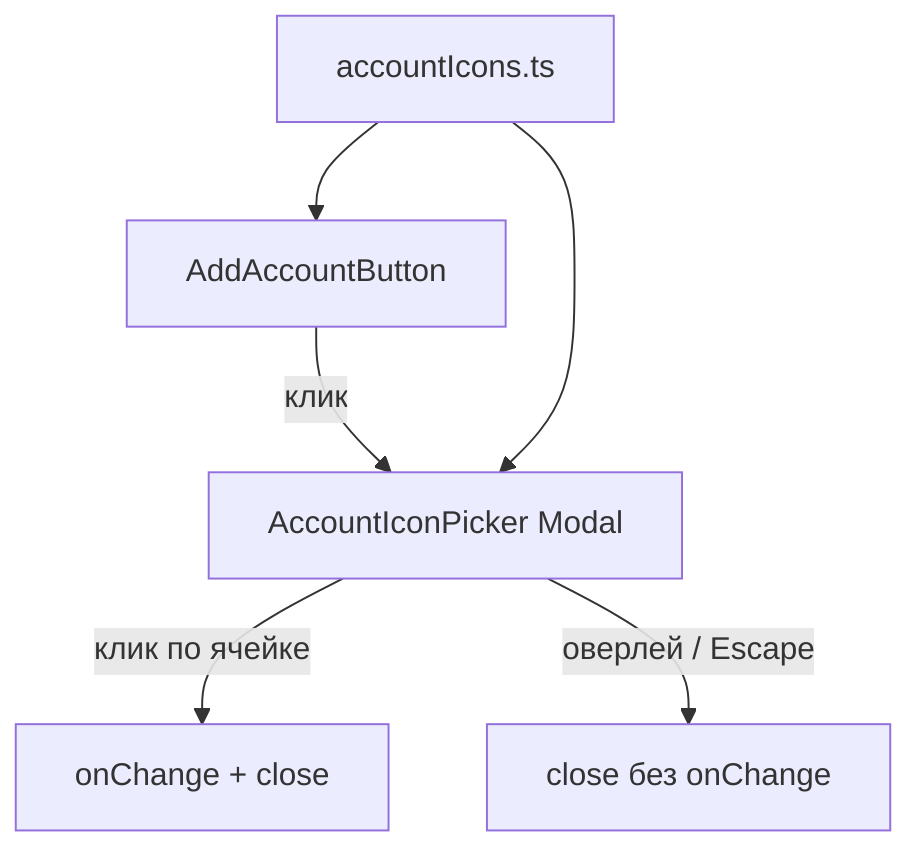

# US-015: общий пикер иконки счёта

**История:** [US-015](current-task/feature.json) — priority 15, `passes: false`. Figma нет (`designReference: []`). PRD §1.6.1.

**Перед работой:** US-014 уже `"passes": true` — не трогать.

**Вне скоупа:** модалка Create account и поля по `AccountType` (US-016); Save в Firefly / appearance (US-017); Edit account (US-020); клик по карточке (US-018); пикер цвета; правки `src/api`. Отдельный хост на Budget / под ParametersBar не делать.

## Контекст

Сейчас каталог — один ключ [`Wallet` → `WalletIcon`](src/modules/budget/components/accountIcons.ts). Карточки резолвят через `resolveAccountIcon`; preference хранит имя **без** суффикса `Icon`. UI-фолбэк — `DEFAULT_ACCOUNT_ICON` / `DEFAULT_ACCOUNT_COLOR` в [`constants.ts`](src/modules/budget/constants.ts). `AccountIcon` — статический враппер (иконка пропом), из‑за `react-hooks/static-components`. Vitest — `*.test.ts` + `environment: 'node'`, компонентных тестов нет. Модалок в приложении ещё нет; Mantine 9 (`Modal`, `ActionIcon`, `useDisclosure`) уже в зависимостях. Роутер — `HashRouter`: `/#/monetta/budget`. Vite **5175**.

Create/Edit модалок нет. Временный вход к пикеру — существующий [`AddAccountButton`](src/modules/budget/components/AddAccountButton/AddAccountButton.tsx): клик открывает модалку. [`Budget.tsx`](src/modules/budget/Budget.tsx) не трогать. US-016 снимет это с Add и вставит пикер в Create account (Add снова откроет форму, бейдж снова Plus).

## Шаги

### 1. Расширить закрытый каталог `ACCOUNT_ICONS`

В [`accountIcons.ts`](src/modules/budget/components/accountIcons.ts) оставить один объект + `resolveAccountIcon` (второй резолвер не заводить). Именованные импорты Phosphor, не весь пакет.

Ключи — PascalCase **без** `Icon` (`Wallet`, `PiggyBank`), как в preferences и в тестах (`Bank`, `PiggyBank` уже встречаются в фикстурах).

Набор (закрытый, финансы + быт). Перед коммитом сверить экспорты `@phosphor-icons/react` 2.1.10; отсутствующее имя **выбросить**, не алиасить:

Wallet, Bank, PiggyBank, CreditCard, Coins, Money, CurrencyDollar, CurrencyEur, Vault, ChartLine, ChartPieSlice, Receipt, House, Buildings, Storefront, ShoppingCart, ShoppingBag, ForkKnife, Coffee, Car, GasPump, Bus, Train, Airplane, Bicycle, Heart, FirstAid, GraduationCap, Briefcase, DeviceMobile, GameController, Gift, PawPrint, Lightning, Drop, Users, Globe, MusicNotes, TShirt, Ticket, Wrench, BookOpen, CalendarBlank, Star, Lock, Envelope, Phone, Baby, Tree, FilmSlate

`DEFAULT_ACCOUNT_ICON` остаётся `'Wallet'`. Неизвестный/пустой ключ по-прежнему → Wallet. Helpers модуля Phosphor не импортируют.

Обновить [`accountIcons.test.ts`](src/modules/budget/components/accountIcons.test.ts): известные имена (`Bank`, `PiggyBank`) резолвятся в свои компоненты; суффикс `WalletIcon` и неизвестное имя → Wallet; в каталоге есть `DEFAULT_ACCOUNT_ICON`.

### 2. Компонент `AccountIconPicker`

Новая папка [`src/modules/budget/components/AccountIconPicker/`](src/modules/budget/components/AccountIconPicker/) (`AccountIconPicker.tsx` + `AccountIconPicker.module.css`). Не в `src/components` — пикер только у Budget create/edit.

Контролируемый, **модалка отдельно от триггера** (триггер в этой истории — Add):

- `opened` + `onClose`
- `value: string | null` — выбранное имя (null → визуально Wallet в сетке)
- `onChange: (name: AccountIconName) => void` — **только** при клике по ячейке
- опционально `color?: string` (дефолт `DEFAULT_ACCOUNT_COLOR`) — чтобы US-016 потом прокинул цвет формы

Собственную кнопку-триггер в пикере **не** рисовать: Add уже кнопка. US-016 обернёт пикер своей icon-button в форме.

**Модалка:** `@mantine/core` `Modal`, `useDisclosure` из `@mantine/hooks`. Заголовок `t('budget.iconPicker.title')` = `Select account icon`. Клик по оверлею и Escape закрывают **без** `onChange` (черновик не нужен: `value` меняется только в `onPick`).

Сетка всех ключей `ACCOUNT_ICONS`. Текущая (или Wallet, если value неизвестен) **подсвечена**. Клик по ячейке: `onChange(name)` и закрыть. Для глифов в сетке — статический враппер с пропом `icon: Icon` (`createElement` / тот же приём, что `AccountIcon`), не `<Icon />` из `Object.entries` во время рендера. Градиентный бейдж карточки в каждой ячейке не копировать — достаточно глифа + обводка/фон у выбранной.

Стили только в CSS module рядом. Модалка `centered`, сетка скроллится, если не влезает.

i18n в [`src/i18n/en.ts`](src/i18n/en.ts): `budget.iconPicker.title`, `budget.iconPicker.open` (aria Add как триггера пикера), `budget.iconPicker.icon` (`{{name}}` для aria ячейки). Подпись слота `budget.addAccount` остаётся.

### 3. Повесить пикер на Add account

В [`AddAccountButton.tsx`](src/modules/budget/components/AddAccountButton/AddAccountButton.tsx): локальный `useState` выбранного имени (`DEFAULT_ACCOUNT_ICON`) + `useDisclosure`. Клик по существующей кнопке открывает модалку. Не persist, не Firefly, `AccountType` не передавать.

Бейдж временно показывает выбранную/дефолтную иконку (через `AccountIcon` / `resolveAccountIcon`) вместо `PlusIcon`, чтобы кнопка выполняла «показывает текущую или дефолтную иконку». Подпись Add не менять. Три блока — три независимых инстанса (свой state у каждой кнопки) — нормально.

[`AccountPageGrid`](src/modules/budget/components/AccountBlock/AccountPageGrid/AccountPageGrid.tsx) и [`Budget.tsx`](src/modules/budget/Budget.tsx) не трогать, кроме импорта пикера внутри Add. Свайп пейджера не ломать: клик по Add не должен уезжать в смену страницы.

В progress/learnings: US-016 снимает пикер с Add, возвращает Plus, открывает Create account.

Карточки, пагинация, Month, итоги, Edit-заглушка — без изменений.

## Проверка

1. **`npm test`** — `accountIcons.test.ts` и остальные зелёные.
2. **`npx tsc -b --pretty false`**
3. **`npm run lint`**
4. **Браузер** (cursor-ide-browser), Vite **5175**, `/#/monetta/login` → `/#/monetta/budget`.

Чеклист в браузере:

- Клик по Add в Income / Current / Expense открывает модалку со **всеми** иконками каталога
- Бейдж Add сначала дефолтный Wallet; после выбора показывает новую иконку, подпись Add на месте
- Выбранная в сетке подсвечена; клик по другой: модалка закрывается, бейдж Add обновляется
- Клик снаружи / Escape закрывает, бейдж остаётся с прежней иконкой
- Повторное открытие подсвечивает последнее **сохранённое** значение, не «наведённое»
- Три Add независимы (выбор в Income не обязан менять Expense)
- Карточки, пагинация, Month, итоги без регрессии; клик по карточке без деталей; Create account ещё нет

Готово, когда пикер выбирает иконку из каталога, оверлей не коммитит выбор, typecheck зелёный, `"passes": true` у US-015.
