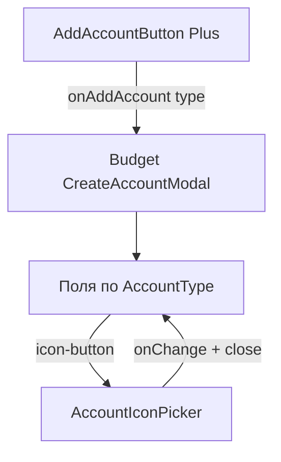

# US-016: общая модалка создания счёта

**История:** [US-016](current-task/feature.json) — priority 16, `passes: false`. Figma нет (`designReference: []`). PRD §1.6.2, поля §1.2.2 / §1.3.2 / §1.4.2.

**Перед работой:** US-015 уже `"passes": true`. Пикер и каталог не ломать; с Add пикер снять.

**Вне скоупа:** `storeAccount` / appearance / инвалидация Query (US-017); валидация пустых полей на Submit (US-017); Edit (US-020); детали карточки (US-018); правки `src/api`.

## Контекст

Временный хост пикера — [`AddAccountButton`](src/modules/budget/components/AddAccountButton/AddAccountButton.tsx): клик открывает `AccountIconPicker`, бейдж показывает выбранную иконку (Plus закомментирован). Карусель пейджера монтирует **до трёх** сеток (prev/current/next), поэтому модалку **нельзя** класть внутрь Add — будут дубли в DOM.

`AccountBlockPager` / хук пейджера **не** знают `AccountType` (это намеренно). Тип есть у [`AccountBlock`](src/modules/budget/components/AccountBlock/AccountBlock.tsx) и у [`Budget.tsx`](src/modules/budget/Budget.tsx).

Пикер уже контролируемый (`opened` / `onClose` / `value` / `onChange`), без своей кнопки и **без** пропа `color` — его добавить в этой истории, когда форма начнёт передавать цвет.

Основная валюта уже грузится через `PRIMARY_CURRENCY_QUERY_KEY` + [`fetchPrimaryCurrency`](src/helpers/currency/fetchPrimaryCurrency.ts). Списка валют ещё нет; в SDK есть `listCurrency` (`/v1/currencies`, пагинация 50).

Vitest: `*.test.ts`, `environment: 'node'`, компонентных тестов нет. i18n — ключи в [`src/i18n/en.ts`](src/i18n/en.ts). Роутер — `HashRouter`, Vite **5175**. Модалки: Mantine 9 `Modal` (`centered`, как у пикера). Форма: `@mantine/form` `useForm`, как логин.

## Шаги

### 1. Одна модалка на странице Budget, не в Add

В [`Budget.tsx`](src/modules/budget/Budget.tsx): `useDisclosure` + `AccountType | null` (или `openedType`). `CreateAccountModal` рендерится **один раз**. Каждый `AccountBlock` получает `onAddAccount={() => open(type)}`.

Прокинуть колбэк вниз **без** `AccountType` в хуке пейджера:

- [`AccountBlock`](src/modules/budget/components/AccountBlock/AccountBlock.tsx) → pager → viewport (`gridForPage`) → [`AccountPageGrid`](src/modules/budget/components/AccountBlock/AccountPageGrid/AccountPageGrid.tsx) → Add

[`AddAccountButton`](src/modules/budget/components/AddAccountButton/AddAccountButton.tsx): вернуть Plus (`PlusIcon` + стили `.badge`), убрать локальный state/пикер. Проп только `onClick`. Accessible name снова `budget.addAccount`. Свайп уже игнорирует `button` в [`usePageSwipe`](src/modules/budget/components/AccountBlock/AccountBlockPager/AccountBlockViewport/usePageSwipe.ts) — `stopPropagation` не нужен.

### 2. `CreateAccountModal` + поля по типу

Новая папка [`src/modules/budget/components/CreateAccountModal/`](src/modules/budget/components/CreateAccountModal/) (`CreateAccountModal.tsx` + CSS module). Не в `src/components`.

Пропсы: `opened`, `onClose`, `accountType: AccountType`. При открытии сбрасывать форму (имя пустое, иконка `DEFAULT_ACCOUNT_ICON`, цвет `DEFAULT_ACCOUNT_COLOR`, баланс `0`, валюта = primary, Expense kind = Expense).

Заголовок по типу (i18n): Create income / current / expense account.

Поля **в порядке PRD**:

- **Income:** имя, иконка, цвет
- **Current:** имя, начальный баланс (0), валюта (primary), цвет, иконка
- **Expense:** тип Expense | Debt (`SegmentedControl` / `Radio.Group`), имя, цвет, иконка; при **Debt** ещё начальный баланс (0) и валюта (primary)

Имя — `TextInput`. Баланс — `NumberInput` (неотрицательный не обязателен: долг/баланс могут быть 0). Валюта — `Select` по enabled-валютам Firefly. Цвет — выбор **из закрытого набора**, не свободный hex (PRD: «available color set»).

Кнопки Cancel и Save есть (chrome формы). **Save в этой истории не вызывает Firefly и не добавляет карточку** (заглушка `onSubmit`; валидация пустых полей — US-017). Cancel, оверлей и Escape закрывают без сохранения.

Вынести видимость полей в маленький хелпер рядом с модалкой, например `createAccountFields.ts` (`type` + `isDebt` → какие слоты показать). Тест рядом с файлом, не в `helpers/tests/`.

Не плодить три модалки и не ветвить три JSX-дерева целиком — один layout, условные слоты.

### 3. Иконка на форме: триггер + существующий пикер

Кнопка-иконка (не Add): внутри `AccountIcon` с текущими `icon` + `color` формы. `aria-label={t('budget.iconPicker.open')}`. Клик открывает уже существующий [`AccountIconPicker`](src/modules/budget/components/AccountIconPicker/AccountIconPicker.tsx).

Добавить в пикер обязательный `color: string` (CSS-переменная на корне сетки, например `--account-icon-picker-color`). Подсветка выбранной ячейки в [`IconCell.module.css`](src/modules/budget/components/AccountIconPicker/IconCell/IconCell.module.css) — от этой переменной, не хардкод `indigo-6`. Клик по ячейке по-прежнему `onChange` + `onClose`; оверлей/Escape пикера **не** меняют иконку и **не** закрывают Create.

Вложенность: обернуть Create и пикер в Mantine 9 `Modal.Stack` (или эквивалентный z-index), чтобы клик по оверлею пикера закрывал только его.

### 4. Закрытый набор цветов

В [`constants.ts`](src/modules/budget/constants.ts): `ACCOUNT_COLORS` (массив hex), обязательно включая `DEFAULT_ACCOUNT_COLOR` (`#4C6EF5`), **белый** (`#FFFFFF`) и **чёрный** (`#000000`). Остальное — стандартные swatches Mantine (indigo/red/teal/yellow/…), без произвольного color picker.

UI: сетка `ColorSwatch` / `ColorPicker` с `swatches={ACCOUNT_COLORS}` и только swatches (`swatchesOnly` / без свободного ввода). На тёмной теме у белого (и при необходимости чёрного) swatch нужна обводка, иначе пятно сливается с фоном модалки.

Выбранный цвет сразу красится на icon-button формы **и** на бейдже `AccountIcon` (карточки тоже через него).

**Контраст глифа:** сейчас [`AccountIcon.module.css`](src/modules/budget/components/AccountIcon/AccountIcon.module.css) всегда рисует иконку белым (`--mantine-color-white`) на градиенте цвета. На белом бейдже глиф станет невидимым. Правило: если фон белый / достаточно светлый — глиф **чёрный**; на остальных цветах (включая чёрный) глиф остаётся **белым**.

Сделать маленькую функцию рядом с иконками (например в `accountIcons.ts` или `accountIconContrast.ts`): hex → цвет глифа. Не хардкодить только точное `'#FFFFFF'`: нормализовать регистр (`#fff` / `#ffffff`). Порог по яркости (relative luminance) проще, чем список исключений. Тест рядом: белый → чёрный глиф, `#4C6EF5` и чёрный → белый глиф.

В CSS бейджа — вторая переменная (`--account-icon-glyph-color`), не переиспользовать `--account-icon-color` для глифа. То же правило применить к подсветке ячеек в пикере, если выбран белый: обводка/глиф должны читаться.

### 5. Список валют для Current и Debt

В `src/helpers/currency/` (не в budget helpers — это данные кошелька, как primary/rates):

- `fetchCurrencies` через `listCurrency` + существующий [`collectFireflyPages`](src/helpers/collectFireflyPages.ts)
- только `enabled !== false`, пропуск без `code`
- маппинг в уже существующий `WalletCurrency`
- ключ `CURRENCIES_QUERY_KEY = ['currency', 'list']`, лимит страницы отдельная константа `50` (не переиспользовать `EXCHANGE_RATES_PAGE_LIMIT` по имени)

В модалке `useQuery` на список + уже существующий primary. Пока primary нет — Select пустой/disabled, дефолт подставить когда придёт код.

Тесты в [`src/helpers/tests/`](src/helpers/tests/), мок `@/api/sdk.gen.ts`, тот же стиль что `fetchPrimaryCurrency.test.ts`.

### 6. i18n

В [`src/i18n/en.ts`](src/i18n/en.ts), английские строки, ключи вроде:

- `budget.createAccount.title.income` / `.current` / `.expense`
- `name`, `initialBalance`, `currency`, `color`, `accountType`, `expense`, `debt`, `cancel`, `save`

Ключи пикера уже есть (`budget.iconPicker.title` / `.open`). `budget.addAccount` = `Add` не менять.

### 7. Что не трогать

Карточки, пагинация, Month, итоги, Edit-заглушка, `useBudgetAccounts`, preference writers, `src/api`. Не писать appearance. Не инвалидировать Query.

## Проверка

1. **`npm test`** — `fetchCurrencies`, `createAccountFields`, контраст глифа, остальные зелёные
2. **`npx tsc -b --pretty false`**
3. **`npm run lint`**
4. **Браузер** (cursor-ide-browser), Vite **5175**, `/#/monetta/login` → `/#/monetta/budget`. Модалку проверить на узком и широком (≥961px) вьюпорте.

Чеклист в браузере:

- Add снова Plus, не выбранная иконка
- Add в Income / Current / Expense открывает **одну** модалку с заголовком своего типа
- Income: только имя, иконка, цвет
- Current: имя, баланс 0, валюта = основная кошелька, цвет, иконка
- Expense: переключатель Expense|Debt; у Expense нет баланса/валюты; у Debt они есть (0 и основная валюта)
- Icon-button показывает дефолтный Wallet и цвет; пикер — весь каталог; клик по иконке закрывает пикер и обновляет кнопку; оверлей пикера не меняет иконку и не закрывает Create
- Смена цвета на форме перекрашивает icon-button (и подсветку в пикере при повторном открытии)
- В палитре есть белый и чёрный; на **белом** бейдже глиф чёрный и читается; на чёрном и indigo глиф белый; белый swatch виден на тёмном фоне модалки
- Cancel / клик снаружи Create закрывают форму; после повторного открытия поля сброшены
- Save **не** создаёт карточку и не ходит в Firefly
- Три независимых входа (тип модалки = блок, из которого нажали Add)
- Карточки, свайп, точки, Month, итоги без регрессии; клик по карточке без деталей

Готово, когда Add открывает общую форму с верным набором полей, пикер живёт на icon-button, typecheck зелёный, `"passes": true` у US-016. В progress/learnings: US-017 вешает Save на `storeAccount`.
