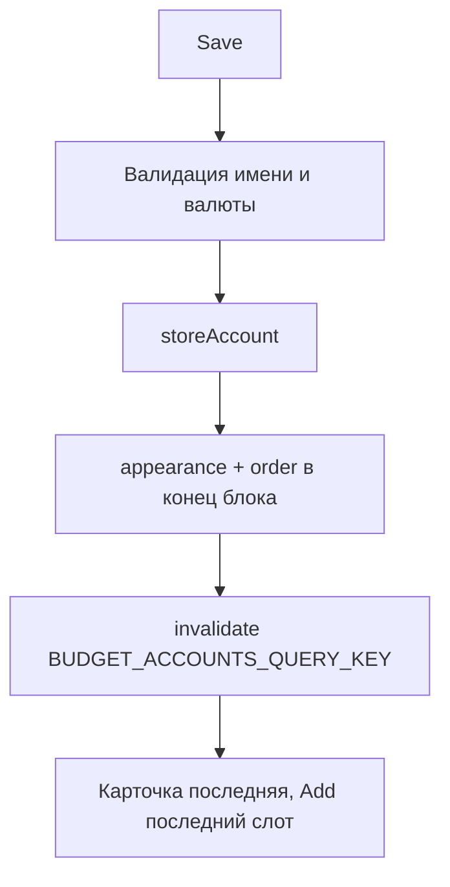

# US-017: сохранять новые счета в Firefly

**История:** [US-017](current-task/feature.json) — priority 17, `passes: false`. Figma нет (`designReference: []`). PRD §1.6.2 и поля §1.2.2 / §1.3.2 / §1.4.2. FR-4, FR-6.

**Перед работой:** US-016 уже `"passes": true`. Модалку, пикер и набор полей не ломать.

**Вне скоупа:** Edit (US-020), детали карточки (US-018), Hide/Delete, правки `src/api`, History.

## Контекст

Save в [`CreateAccountModal.tsx`](src/modules/budget/components/CreateAccountModal/CreateAccountModal.tsx) сейчас только вызывает `onClose()`. Форма и видимость полей уже есть: [`useCreateAccountForm.ts`](src/modules/budget/hooks/useCreateAccountForm.ts), [`createAccountVisibility.ts`](src/modules/budget/helpers/createAccountVisibility.ts).

Готово для записи:

- `storeAccount` в SDK (`POST /v1/accounts`), тип `AccountStore`
- [`writeAccountAppearance`](src/modules/budget/helpers/writeAccountPreferences.ts) / [`writeAccountOrder`](src/modules/budget/helpers/writeAccountPreferences.ts)
- ключ Query: префикс [`BUDGET_ACCOUNTS_QUERY_KEY`](src/modules/budget/constants.ts) (`['budget', 'accounts']`); живой ключ `['budget', 'accounts', date]`
- порядок блока уже в кеше `useBudgetAccounts` — новые id дописываем в конец видимого списка

Learnings US-016: валюта для persist — `form.currency`, без `|| primary`. Vitest: `*.test.ts`, `environment: 'node'`, без компонентных тестов. Мок SDK как в [`fetchBudgetAccounts.test.ts`](src/modules/budget/helpers/tests/fetchBudgetAccounts.test.ts). i18n — [`src/i18n/en.ts`](src/i18n/en.ts). Vite **5175**, `HashRouter`, Budget `#/monetta/budget`.



## Шаги

### 1. Маппинг формы → `AccountStore`

Новый хелпер [`src/modules/budget/helpers/toAccountStoreBody.ts`](src/modules/budget/helpers/toAccountStoreBody.ts) (чистая функция). Вход: `accountType`, значения формы, `openingBalanceDate` (`YYYY-MM-DD`). Имя — `trim`.

| Форма | Firefly `type` | Дополнительно |
| --- | --- | --- |
| Income | `revenue` | только `name` |
| Current | `asset` | `account_role: 'defaultAsset'` (в схеме обязательно для asset), `currency_code: form.currency`, `opening_balance` + `opening_balance_date` |
| Expense | `expense` | только `name` |
| Debt | `liability` | `liability_type: 'debt'`, `liability_direction: 'debit'` (долг пользователя), `interest: '0'`, `interest_period: 'monthly'`, валюта и opening как у Current |

Константы дефолтов Firefly — в [`constants.ts`](src/modules/budget/constants.ts), не магические строки в хелпере. `opening_balance` — строка из числа (`String(initialBalance)`), дата — аргумент, не `dayjs` внутри React. Дату брать из уже существующего [`defaultTransactionDate`](src/modules/budget/helpers/budgetMonth.ts) по выбранному месяцу Budget (как у будущих транзакций US-024), чтобы баланс current/debt был виден в текущем месяце пейджера.

Не слать `currency` / opening у Income и обычного Expense.

### 2. Оркестратор `createBudgetAccount`

Новый [`src/modules/budget/helpers/createBudgetAccount.ts`](src/modules/budget/helpers/createBudgetAccount.ts):

1. `storeAccount({ body })`, `throwOnError` не включать.
2. Взять `id` из `result.data.data.id`; нет payload / пустой id — бросить, как currency/accounts fetchers.
3. `writeAccountAppearance(id, { icon, color })`.
4. `writeAccountOrder(type, [...orderedIds.filter((item) => item !== id), id])` — новый счёт **последний среди счетов** блока.
5. Prefs не писать, если store не удался.

`orderedIds` передавать снаружи (id текущего блока из кеша Budget), не делать второй `listPreference`.

### 3. Валидация и Submit в форме

Расширить [`useCreateAccountForm.ts`](src/modules/budget/hooks/useCreateAccountForm.ts) (паттерн [`useLoginForm.ts`](src/modules/login/hooks/useLoginForm.ts)):

- `validate`: имя обязательно после trim; `currency` обязательно только если `createAccountVisibility(type, isDebt).showMoney`. Иконка и цвет уже с дефолтами; баланс `0` валиден.
- Чистый `validateCreateAccountForm` рядом в helpers, чтобы покрыть тестом без UI.
- Submit: `createBudgetAccount` → `useQueryClient().invalidateQueries({ queryKey: BUDGET_ACCOUNTS_QUERY_KEY })` → `onClose`. Инвалидировать префикс, не ключ с датой.
- `isSubmitting`: повторный клик игнорировать; Save disabled / loading как на логине.
- Ошибка Firefly (сеть, 422): модалку не закрывать, счёт не считать созданным; текст через i18n (`budget.createAccount.errors.*`). Дубликат имени можно повесить на поле `name`, если в `error` есть ключ; иначе общее `saveFailed`.
- Если store прошёл, а prefs упали: всё равно инвалидировать и закрыть (счёт уже в Firefly; карточка с UI-фолбэком Wallet/`#4C6EF5`). Не жать Save повторно.

Пропсы модалки / хука: `orderedIds: string[]`, `month: string`, плюс текущие `opened` / `onClose` / `accountType`.

В [`Budget.tsx`](src/modules/budget/Budget.tsx):

```ts
orderedIds={data?.[create.type].map((account) => account.id) ?? []}
month={month}
```

### 4. Страница пейджера после создания

Отдельный стейт страницы не нужен. [`useAccountBlockPager`](src/modules/budget/hooks/useAccountBlockPager.ts) держит `pageIndex`; `clampPageIndex` не сбрасывает на 0 при росте списка. Блоки не размонтируются при refetch (`data` из кеша остаётся).

Ожидаемое поведение (проверить в браузере, не кодировать jump):

- Add был последним слотом полной страницы (мобилка: 4-й) → после создания эта страница из 4 счетов включая новый, Add на новой последней; остаёмся на странице с новым счётом (предпоследней).
- Add не заполнял страницу → новый счёт и Add на той же странице.
- Add всегда последний слот `toAccountPageItems`.

Не ставить `key` на `AccountBlock` от длины списка и не делать `setPageIndex(0)` при смене `accounts`.

### 5. i18n

В [`src/i18n/en.ts`](src/i18n/en.ts) под `budget.createAccount.errors`: `nameRequired`, `currencyRequired`, `saveFailed`. Все строки через ключи.

## Тесты

В [`src/modules/budget/helpers/tests/`](src/modules/budget/helpers/tests/):

- `toAccountStoreBody.test.ts` — четыре типа тела; trim имени; у Income/Expense нет currency/opening; у Current `defaultAsset`; у Debt liability-поля.
- `createBudgetAccount.test.ts` — мок `storeAccount` + `updatePreference`; порядок вызовов store → appearance → order с `[...ids, newId]`; при отсутствии `data` prefs не пишутся.
- `validateCreateAccountForm.test.ts` — пустое имя; пустая валюта только для Current/Debt.

Фикстуры SDK — существующий [`testHelpers.ts`](src/modules/budget/helpers/tests/testHelpers.ts) (`createRequest`).

## Верификация

- `npm test`
- `npx tsc -b --pretty false`
- `npm run lint`
- Браузер (agent-browser / MCP), mobile и desktop (`HashRouter`, `#/monetta/budget`):
  - Income / Current / Expense / Debt: Save создаёт счёт в Firefly, карточка с выбранными иконкой и цветом **последняя среди счетов**, Add последний.
  - Пустое имя (и пустая валюта у Current/Debt) — ошибка, запроса нет.
  - Мобилка: 3 счёта + Add на одной странице → после создания 4 карточки на текущей, Add на новой; страница не прыгает на 0.
  - Cancel / клик снаружи по-прежнему без записи.
- В `feature.json` у US-017 `"passes": true`; learnings в `progress.txt`.
