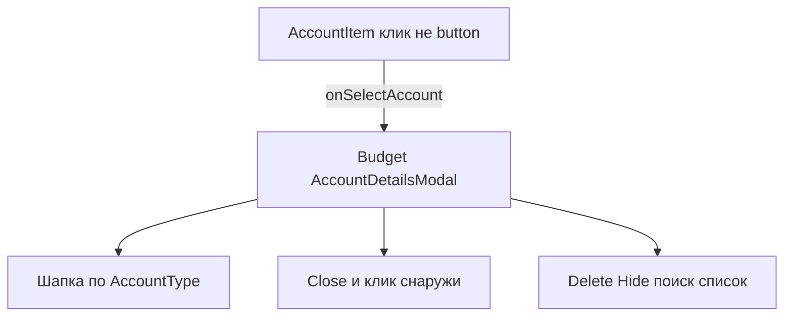

# US-018: общая модалка деталей счёта

**История:** [US-018](current-task/feature.json) — priority 18, `passes: false`. Figma нет (`designReference: []`). PRD §1.6.5 и шапки §1.2.3 / §1.3.3 / §1.4.3. FR-6 (открытие деталей; мутации — следующие истории).

**Перед работой:** US-017 уже `"passes": true`. Create, Save, пейджер и свайп не ломать.

**Вне скоупа:** загрузка транзакций и поиск (US-019), EditAccountModal (US-020), deleteAccount (US-021), PATCH `active=false` (US-022), правки `src/api`.

## Контекст

Карточки сейчас не кликабельны: [`AccountItem`](src/modules/budget/components/AccountItem/AccountItem.tsx) — `div` без `onClick` (learnings: «Cards are not buttons (US-018)»). Create уже живёт **один раз** на [`Budget.tsx`](src/modules/budget/Budget.tsx), не внутри Add — карусель пейджера монтирует до трёх сеток.

Свайп в [`usePageSwipe`](src/modules/budget/hooks/usePageSwipe.ts) **не стартует**, если `event.target.closest('button')`. Поэтому карточку **нельзя** делать нативным `<button>` — иначе свайп по счетам сломается. После свайпа клик уже глушится через `onClickCapture` (`didSwipe`).

Видимость полей шапки совпадает с созданием: [`createAccountVisibility`](src/modules/budget/helpers/createAccountVisibility.ts) (`showKind` / `showMoney`). Переиспользовать, не копировать switch.

Vitest: `*.test.ts`, `environment: 'node'`, компонентных тестов нет. История не требует новых тестов (в `changes` только typecheck и браузер). i18n — [`src/i18n/en.ts`](src/i18n/en.ts). Vite **5175**, `HashRouter`, Budget `#/monetta/budget`. Модалки: Mantine 9 `Modal` `centered`.

## Шаги

### 1. Клик по карточке, одна модалка на Budget

В [`Budget.tsx`](src/modules/budget/Budget.tsx): сессия как у Create — `{ opened, account }`, при закрытии `opened: false`, последний `account` оставить для анимации (не размонтировать модалку, тот же урок US-017). `AccountDetailsModal` рендерится **один раз** рядом с Create, не внутри карточки.

Прокинуть `onSelectAccount` вниз **без** смены хука пейджера:

- [`AccountBlock`](src/modules/budget/components/AccountBlock/AccountBlock.tsx) → pager → viewport (`gridForPage`) → [`AccountPageGrid`](src/modules/budget/components/AccountBlock/AccountPageGrid/AccountPageGrid.tsx) → [`AccountItem`](src/modules/budget/components/AccountItem/AccountItem.tsx)

[`AccountItem`](src/modules/budget/components/AccountItem/AccountItem.tsx): `onClick` + `role="button"` + `tabIndex={0}` + Enter/Space; **не** `<button>`. `cursor: pointer`. Add по-прежнему свой `button` и открывает Create.

### 2. `AccountDetailsModal` — шапка по типу + Close

Новая папка [`src/modules/budget/components/AccountDetailsModal/`](src/modules/budget/components/AccountDetailsModal/) (`AccountDetailsModal.tsx` + CSS module). Не в `src/components`.

Пропсы: `opened`, `onClose`, `account: BudgetAccount | null`. Если `account === null`, модалка закрыта. Заголовок — имя счёта. Close: штатный крестик Mantine (`aria-label` через i18n) и клик по overlay (`onClose`). `closeOnClickOutside` оставить включённым.

Шапка — **только чтение**, визуально как tinted-блок Create (цвет счёта, глиф через `accountIconGlyphColor` / [`AccountIcon`](src/modules/budget/components/AccountIcon/AccountIcon.tsx), не [`AccountIconButton`](src/modules/budget/components/AccountIconButton/AccountIconButton.tsx) — пикер не открывать). Справа в шапке `ActionIcon` с `PencilSimpleIcon` (как в [`ParametersBar`](src/modules/budget/components/ParametersBar/ParametersBar.tsx)). Клик карандаша **ничего не делает** (US-020).

Поля шапки через `createAccountVisibility(account.type, account.isDebt)`:

- **Income:** имя, иконка, цвет (фон блока)
- **Current:** то же + баланс (`account.balance` через [`formatAccountAmount`](src/modules/budget/helpers/formatAccountAmount.ts)) и валюта. Подпись не `Initial balance`, а отдельный ключ вроде `budget.accountDetails.balance`
- **Expense:** тип Expense | Debt текстом (не `ExpenseKindControl` — тип после создания не меняется); у Debt ещё сумма долга (красным) и paid (зелёным), как на карточке

Иконка: `resolveAccountIcon(account.icon)`, цвет: `account.color ?? DEFAULT_ACCOUNT_COLOR`.

### 3. Плейсхолдеры Delete, Hide, поиск, список

В теле модалки, без API:

- Поиск: `TextInput` без фильтрации (disabled или `readOnly`), ключ вроде `budget.accountDetails.search`
- Список: пустая область с текстом-заглушкой; строку «No transactions found…» **не** вводить как боевой empty state — это US-019. Достаточно нейтрального плейсхолдера (`budget.accountDetails.transactionsPlaceholder`)
- Кнопки Delete и Hide: видны, `type="button"`, без confirm и без SDK. Подписи i18n (`budget.accountDetails.delete` / `hide`)

Все пользовательские строки — ключи в [`src/i18n/en.ts`](src/i18n/en.ts).

## Верификация

- `npx tsc -b --pretty false`
- `npm run lint`
- `npm test` (регрессия; новых тестов история не требует)
- Браузер (agent-browser), mobile `<961px` и desktop `>=961px`, `#/monetta/budget`:
  - клик Income / Current / Expense / Debt открывает модалку; шапка отличается по типу (у обычного Expense нет денег, у Debt — долг и paid)
  - карандаш виден и не открывает другую модалку
  - Close (крестик) и клик снаружи закрывают
  - плейсхолдеры поиска, списка, Delete, Hide на месте и ничего не меняют в Firefly
  - короткий тап открывает детали; свайп по карточкам листает страницу и **не** открывает модалку
  - Add по-прежнему открывает Create, не детали

После приёмки: `US-018` → `"passes": true`, запись в [`current-task/progress.txt`](current-task/progress.txt) и [`current-task/learnings.txt`](current-task/learnings.txt).
