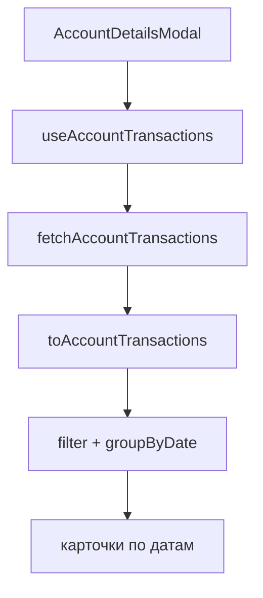

# US-019: транзакции и поиск в AccountDetailsModal

**История:** [US-019](current-task/feature.json) — priority 19, `passes: false`. Figma нет (`designReference: []`). PRD §1.2.3.4–1.2.3.5, §1.3.3.4–1.3.3.5, §1.4.3.4–1.4.3.5 (общий список в §1.6.5). FR-6 (чтение; мутации — позже).

**Перед работой:** US-018 уже `"passes": true`. Шапка, Close, карандаш-заглушка, Delete/Hide без SDK не ломать. Свайп пейджера не трогать.

**Вне скоупа:** клик по карточке → EditTransactionModal (US-029), Edit счёта (US-020), Delete/Hide (US-021/022), бесконечный скролл History (US-030), правки `src/api`.

## Контекст

Сейчас в [`AccountDetailsModal`](src/modules/budget/components/AccountDetailsModal/AccountDetailsModal.tsx) поиск `readOnly`, список — dashed-плейсхолдер `budget.accountDetails.transactionsPlaceholder`.

Firefly: `listTransactionByAccount` → `GET /v1/accounts/{id}/transactions` (query: `page`, `limit`; **без** `start`/`end`/`type` — нужны **все** транзакции счёта, не месяц Budget). Ответ — `TransactionArray`: группа с `attributes.transactions: TransactionSplit[]`. Пейджинг как у счетов: [`collectFireflyPages`](src/helpers/collectFireflyPages.ts), `limit` 50, отдельная константа (не переиспользовать имя `ACCOUNTS_PAGE_LIMIT`).

Поиск — **клиентский** по уже загруженному списку: у `listTransactionByAccount` нет search-query. Пустой запрос показывает всё.

Vitest: `*.test.ts`, `environment: 'node'`, без компонентных тестов. Хелперы — тесты в [`src/modules/budget/helpers/tests/`](src/modules/budget/helpers/tests/), SDK-фикстуры в `testHelpers.ts`. i18n — [`src/i18n/en.ts`](src/i18n/en.ts). Vite **5175**, Budget `#/monetta/budget`. Модалка: Mantine 9 `Modal` `centered`. React-файлы **не** импортируют dayjs (даты — в helpers).

## Шаги

### 1. Модель и загрузка

Тип в [`src/modules/budget/types/`](src/modules/budget/types/) (например `accountTransaction.ts`): `id` группы Firefly, `journalId`, `date` (`YYYY-MM-DD`), исходный `dateTime`, `description`, `sourceName` / `destinationName`, `amount` (number из строки), `currencyCode` / `currencySymbol`, опционально `type` и `tags` для поиска. Пропускать сплиты без id/даты.

[`fetchAccountTransactions(accountId)`](src/modules/budget/helpers/fetchBudgetAccounts.ts): `listTransactionByAccount({ path: { id }, query: { page, limit } })` + `collectFireflyPages`. Missing `data` — throw с константой вроде `ACCOUNT_TRANSACTIONS_MISSING_ERROR`. Пустой `data: []` валиден.

Маппер `toAccountTransactions`: плоско развернуть все сплиты всех групп. Ключ карточки: `journalId` или `${groupId}:${index}`.

Префикс Query: `['budget', 'accountTransactions']` — **не** вкладывать в `['budget', 'accounts']`, иначе `invalidateQueries` счетов начнёт рефетчить списки транзакций. Живой ключ: `[...prefix, accountId]`.

Хук `useAccountTransactions(accountId, enabled)` — тонкий `useQuery`, как [`useBudgetAccounts`](src/modules/budget/hooks/useBudgetAccounts.ts). `enabled: opened && Boolean(accountId)`. Без `placeholderData`. Persist IndexedDB уже общий.

### 2. Группировка, поиск, пустое состояние

Чистые хелперы (dayjs только здесь):

- дата группы: календарный день Firefly (`YYYY-MM-DD` из ISO), не месяц Budget;
- группы по убыванию даты; внутри дня — по убыванию `dateTime`;
- `filterAccountTransactions(items, query)`: trim, case-insensitive `includes` по описанию, from/to, валюте (code и symbol), сумме и прочим полям карточки (`type`, теги, если маппим). Пустая строка → все элементы.

Подпись группы — английский формат вроде `D MMM YYYY`.

В модалке:

- `TextInput` поиска **редактируемый**, локальный `useState`; сброс при смене `account.id`.
- Список скроллится внутри модалки (`overflow: auto`, ограниченная высота), шапка/поиск/Delete/Hide остаются на месте.
- Нет данных и не loading/error → **`No transactions found for this account`** (`budget.accountDetails.noTransactions`). Тот же текст, если поиск ничего не нашёл.
- Loading — короткий статус в области списка; ошибка — ключ вроде `budget.accountDetails.loadFailed`. Плейсхолдер `transactionsPlaceholder` убрать.

Карточка (свой CSS module рядом, не общий `src/components`):

- дата — заголовок блока, не на каждой карточке;
- **From** и **To** (US-019 явно ищет оба; PRD копипастит только «To»);
- описание, если не пустое;
- сумма + валюта через [`formatAccountAmount`](src/modules/budget/helpers/formatAccountAmount.ts). Двойную валюту History (красное − / зелёное +) **не** делать.

Карточка **не** кликабельна (US-029). Не `<button>` — в пейджере это не нужно, но и не провоцировать будущий конфликт.

Delete/Hide/карандаш без изменений.

Закрытие: в [`Budget.tsx`](src/modules/budget/Budget.tsx) оставить последний `account` при `opened: false` (как в learnings US-018), чтобы fade-out не сбрасывал шапку и список. `enabled` хука всё равно завязан на `opened`.

### 3. Тесты и i18n

Тесты:

- `fetchAccountTransactions` — мок `listTransactionByAccount`, две страницы, `path.id`, без `start`/`end`;
- маппер: несколько сплитов, пропуск пустых;
- фильтр и группировка: регистр, пустой query, две даты desc.

Строки в `en.ts`: `noTransactions`, `from` / `to` (`From {{name}}` / `To {{name}}`), loading/error списка. Интерполяция `{{name}}`.

## Верификация

- `npx tsc -b --pretty false`
- `npm run lint`
- `npm test`
- Браузер (agent-browser), mobile `<961px` и desktop `>=961px`, `#/monetta/budget`:
  - открыть Income / Current / Expense / Debt — список с группировкой по дате (не только выбранный месяц Budget);
  - счёт без транзакций — «No transactions found for this account»;
  - поиск сужает список по описанию, from/to, валюте; пустой поиск возвращает всё; без совпадений — то же empty;
  - Close и overlay по-прежнему закрывают; Delete/Hide/карандаш без API;
  - короткий тап по карточке счёта открывает детали, свайп страницу не открывает модалку.

После приёмки: `US-019` → `"passes": true`, запись в [`current-task/progress.txt`](current-task/progress.txt) и [`current-task/learnings.txt`](current-task/learnings.txt).
