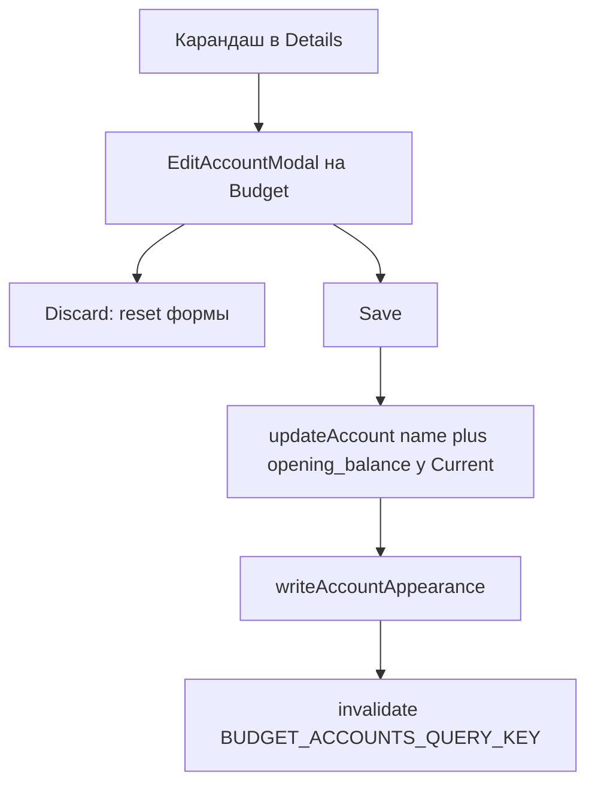

# US-020: редактировать счёт и откатывать несохранённые правки

**История:** [US-020](current-task/feature.json) — priority 20, `passes: false`. Figma нет (`designReference: []`). PRD §1.6.3 и поля §1.2.4 / §1.3.4 / §1.4.4. FR-4, FR-6. Resolved: баланс current — PUT счёта (`opening_balance`), не reconciliation.

**Перед работой:** US-019 уже `"passes": true`. Create, детали, список транзакций и пейджер не ломать.

**Вне скоупа:** Delete (US-021), Hide (US-022), EditTransactionModal (US-029), правка типа expense/debt, смена валюты, `writeAccountOrder`, правки `src/api`.

## Контекст

Карандаш в [`AccountDetailsHeader.tsx`](src/modules/budget/components/AccountDetailsModal/AccountDetailsHeader/AccountDetailsHeader.tsx) — `ActionIcon` без `onClick`. Create уже живёт **один раз** на [`Budget.tsx`](src/modules/budget/Budget.tsx) с `Modal.Stack` для пикера.

SDK: `updateAccount` — **PUT** `/v1/accounts/{id}` ([`sdk.gen.ts`](src/api/sdk.gen.ts)). В [`AccountUpdate`](src/api/types.gen.ts) обязателен `name`; `current_balance` только для чтения в `AccountProperties`. Пишем `opening_balance` строкой для Current. Тип счёта в тело не слать.

Видимость Create (`createAccountVisibility`) **не подходит**: у Create Debt показывает деньги, у Edit — нет; тип expense/debt не редактируется.

## Шаги

### 1. Видимость полей и тело PUT

Новый [`src/modules/budget/helpers/editAccountVisibility.ts`](src/modules/budget/helpers/editAccountVisibility.ts) — exhaustive `switch` по `AccountType`:

- Income / Expense: только имя, иконка, цвет
- Current: то же + баланс (без валюты)
- `showKind` нигде

Новый [`src/modules/budget/helpers/toAccountUpdateBody.ts`](src/modules/budget/helpers/toAccountUpdateBody.ts) → `AccountUpdate`:

- всегда `{ name: trimmed }`
- Current: плюс `opening_balance: String(balance)`
- не слать `type`, `currency_code`, liability-поля, `opening_balance` у Income/Expense

Не слать лишние ключи: комментарий SDK («опущенные поля обнуляются») проверить на живом Firefly; в тело только то, что в `AccountUpdate`.

### 2. Оркестратор `updateBudgetAccount`

Новый [`src/modules/budget/helpers/updateBudgetAccount.ts`](src/modules/budget/helpers/updateBudgetAccount.ts) по образцу [`createBudgetAccount.ts`](src/modules/budget/helpers/createBudgetAccount.ts):

1. `updateAccount({ path: { id }, body })`, `throwOnError` не включать
2. Нет `data` / throw → `{ ok: false, reason }`; 422 с `errors.name` → `NAME`, иначе `FAILED`
3. При успехе `writeAccountAppearance(id, { icon, color })` через `allSettled` (prefs упали — всё равно `ok: true`, как у Create)
4. **Не** вызывать `writeAccountOrder`

Результат — тот же tagged `{ ok, reason }` (`CREATE_BUDGET_ACCOUNT_FAILURE_REASON` / `CreateBudgetAccountResult`), не копировать swallows. Мелкий `hasNameError` вынести рядом, чтобы Create и Edit делили одну проверку 422.

### 3. `EditAccountModal` + форма

Папка [`src/modules/budget/components/EditAccountModal/`](src/modules/budget/components/EditAccountModal/) (`tsx` + свой CSS module, скопировать раскладку Create: tinted-блок, `AccountIconButton`, [`AccountColorPicker`](src/modules/budget/components/AccountColorPicker/AccountColorPicker.tsx)). Не в `src/components`. Create и Edit **не сливать**.

Поля:

- имя — `TextInput`, обязательно после trim (тот же ключ `budget.createAccount.errors.nameRequired`)
- иконка — [`AccountIconPicker`](src/modules/budget/components/AccountIconPicker/AccountIconPicker.tsx) в `Modal.Stack` (`stackId` свой, например `edit-account` / `edit-account-icon-picker`), overlay пикера не закрывает Edit
- цвет — закрытый `ACCOUNT_COLORS`
- Current: `NumberInput` с подписью `budget.accountDetails.balance` (не `initialBalance`), без Select валюты. `0` валиден. Не брать [`AccountMoneyFields`](src/modules/budget/components/AccountMoneyFields/AccountMoneyFields.tsx)

Не показывать `ExpenseKindControl`.

Хук [`src/modules/budget/hooks/useEditAccountForm.ts`](src/modules/budget/hooks/useEditAccountForm.ts):

- `initialValues` из `BudgetAccount`: имя, `toAccountIconName(icon)`, `color ?? DEFAULT_ACCOUNT_COLOR`, `balance`
- **Discard:** `form.reset()` к последним сохранённым `initialValues`, Firefly не звать, модалку не закрывать
- после успешного Save: `form.setInitialValues(values)` (чтобы повторный Discard шёл к только что сохранённому), `invalidateQueries({ queryKey: BUDGET_ACCOUNTS_QUERY_KEY })`, закрыть Edit
- `isSubmitting`, ошибка `saveFailed`; Details оставляем открытой
- валютный Query не нужен

Кнопки: Discard (`type="button"`) + Save (`type="submit"`). Close/крестик/overlay Edit — как у Create (`onClose`), без записи.

Заголовки: `budget.editAccount.title.income|current|expense` («Edit income account» и т.д.). Подписи name/color/save переиспользовать из `budget.createAccount.*`.

Модалка всегда смонтирована, как Create: `opened={edit.opened}`. Сессия на Budget, `key` при каждом открытии (как `create.id`), чтобы форма не тащила значения предыдущего счёта.

### 4. Проводки: карандаш → Budget, живой счёт в Details

[`Budget.tsx`](src/modules/budget/Budget.tsx): сессия edit по образцу details (`opened` + `account`, при закрытии `account` оставить для анимации). `EditAccountModal` рядом с Create и Details, не внутри карточки.

Карандаш: `onEdit` из Budget → [`AccountDetailsModal`](src/modules/budget/components/AccountDetailsModal/AccountDetailsModal.tsx) → Body → Header. Details не закрывать.

После Save карточка и шапка Details должны взять свежие данные из `useBudgetAccounts`: передавать в Details `find` по `id` в `data` с фолбэком на `details.account` (пока refetch не пришёл). Имя в `title` модалки тоже от живого счёта.

### 5. i18n

В [`src/i18n/en.ts`](src/i18n/en.ts) под `budget.editAccount`: `title.income|current|expense`, `discard`. Save/ошибки/имя — существующие ключи Create и `budget.accountDetails.balance`.

## Тесты

В [`src/modules/budget/helpers/tests/`](src/modules/budget/helpers/tests/), мок SDK как у Create, фикстуры [`testHelpers.ts`](src/modules/budget/helpers/tests/testHelpers.ts). Компонентных тестов нет (`environment: 'node'`).

- `editAccountVisibility.test.ts` — Income/Current/Expense; Debt не открывает баланс
- `toAccountUpdateBody.test.ts` — trim имени; Current с `opening_balance`; Income/Expense без баланса
- `updateBudgetAccount.test.ts` — PUT затем appearance; order не пишется; нет `data` → prefs нет; prefs throw → всё равно `ok: true`
- валидация пустого имени — существующий `validateCreateAccountForm` с `showMoney: false` или тонкий `validateEditAccountForm`

## Верификация

- `npm test`
- `npx tsc -b --pretty false`
- `npm run lint`
- Браузер (agent-browser MCP), mobile и desktop (`HashRouter`, `#/monetta/budget`):
  - карандаш на Income / Current / Expense / Debt открывает Edit с нужными полями; тип Expense|Debt не редактируется
  - правка имени, иконки, цвета → Save → карточка и шапка Details обновляются; appearance в preferences
  - Current: смена баланса → новая сумма на карточке и в parameters bar Balance (инвалидация счетов); в Firefly нет reconciliation
  - Discard после правок возвращает последние сохранённые значения, запросов нет, модалка открыта
  - пустое имя блокирует Save; overlay/Close Edit без записи; Details после закрытия Edit на месте
  - пикер иконки: клик выбирает, клик снаружи не меняет иконку и не закрывает Edit
- В `feature.json` у US-020 `"passes": true`; learnings в `progress.txt` / `learnings.txt`
