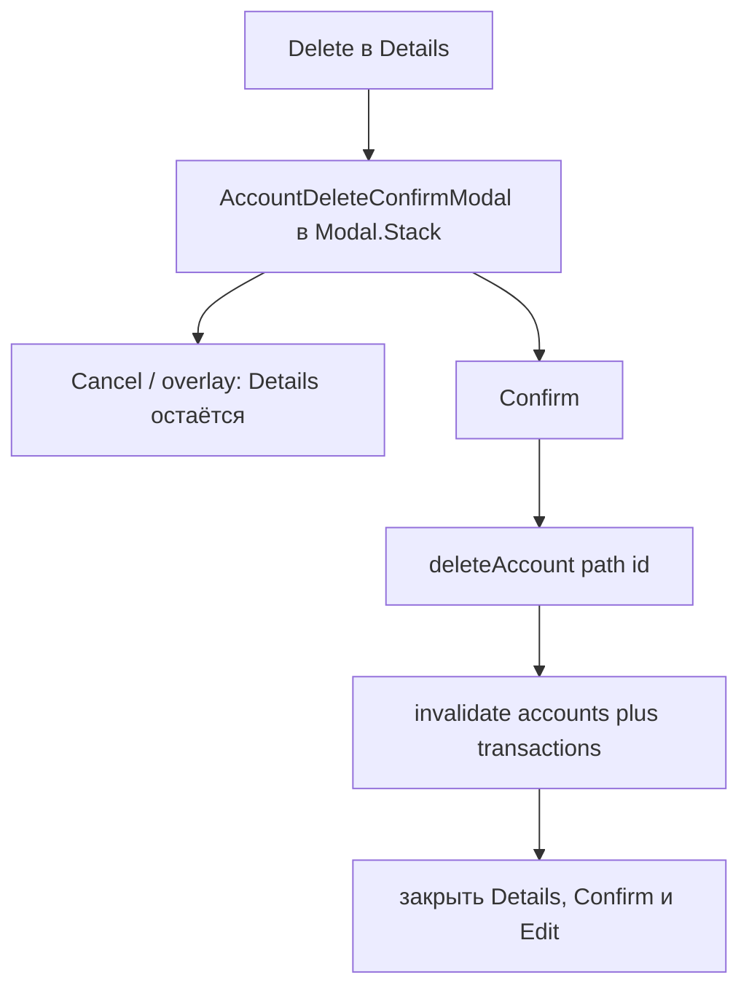

# US-021: удалять счёт с подтверждением

**История:** [US-021](current-task/feature.json) — priority 21, `passes: false`. Figma нет (`designReference: []`). PRD §1.2.3.2 / §1.3.3.2 / §1.4.3.2: *Do you want to delete the {name} account? This action cannot be undone.* FR-6.

**Перед работой:** US-020 уже `"passes": true`. Create, Edit, поиск транзакций и пейджер не ломать.

**Вне скоупа:** Hide (US-022), правка транзакций (US-029), чистка `monetta.accountAppearance.*` / `monetta.accountOrder.*`, правки `src/api`.

## Контекст

Кнопка Delete в [`AccountDetailsBody.tsx`](src/modules/budget/components/AccountDetailsModal/AccountDetailsBody/AccountDetailsBody.tsx) — красная `Button` без `onClick`. Details и Edit уже живут **на Budget** в `Modal.Stack`, пока `details.opened || edit.account`. Подтверждение удаления — третий sibling-Modal в том же стеке (как Edit), не `@mantine/modals` (пакета нет).

SDK: `deleteAccount` — **DELETE** `/v1/accounts/{id}` ([`sdk.gen.ts`](src/api/sdk.gen.ts)). Успех — **204 void**, не JSON:API `data`. `throwOnError` не включать (как login/create/edit). Проверка успеха — `response.ok` / `status === 204`. Паттерн Create/Edit «нет `result.data` → fail» здесь **нельзя**: на 204 `data` пустой.

`sortAccountsByOrder` уже пропускает id, которых нет в списке — preference порядка чистить не нужно.

## Шаги

### 1. Helper `deleteBudgetAccount` + тесты

Новый [`src/modules/budget/helpers/account/deleteBudgetAccount.ts`](src/modules/budget/helpers/account/deleteBudgetAccount.ts) по образцу [`updateBudgetAccount.ts`](src/modules/budget/helpers/account/updateBudgetAccount.ts):

1. `deleteAccount({ path: { id } })`
2. throw / не-2xx → `{ ok: false, reason: FAILED }`
3. 204/ok → `{ ok: true }`
4. **Не** писать appearance и order

Результат — узкий tagged `{ ok, reason }` (достаточно `FAILED`, без `NAME`). Не переиспользовать `CreateBudgetAccountResult` с причиной `name`.

Тесты в [`src/modules/budget/helpers/account/tests/deleteBudgetAccount.test.ts`](src/modules/budget/helpers/account/tests/deleteBudgetAccount.test.ts): мок `deleteAccount` из `@/api/sdk.gen.ts` (как create/update). Кейсы: 204 → ok; 404/сеть → failed; `updatePreference` не вызывается. Фикстуру 204 добавить в [`testHelpers.ts`](src/modules/budget/helpers/account/tests/testHelpers.ts), если удобно.

### 2. i18n и модалка подтверждения

В [`src/i18n/en.ts`](src/i18n/en.ts) под `budget.accountDetails`:

- `deleteConfirm`: `Do you want to delete the {{name}} account? This action cannot be undone.`
- `deleteFailed`: `Could not delete the account`

Cancel — уже есть `budget.createAccount.cancel`. Delete — уже есть `budget.accountDetails.delete`. Интерполяция `{{name}}`, без `Trans`.

Новый [`AccountDeleteConfirmModal`](src/modules/budget/components/AccountDeleteConfirmModal/AccountDeleteConfirmModal.tsx) + CSS module рядом:

- `Modal` `centered`, `stackId='account-delete-confirm'`
- текст подтверждения, Cancel, красный Delete с `loading`
- overlay/Escape/Cancel закрывают только confirm; Details не закрывать
- ошибка API — текст под кнопками, модалка остаётся

Хук [`useDeleteBudgetAccount`](src/modules/budget/hooks/useDeleteBudgetAccount.ts): `queryClient` + helper; при успехе `invalidateQueries` префиксов `BUDGET_ACCOUNTS_QUERY_KEY`, `[...ACCOUNT_TRANSACTIONS_QUERY_KEY, id]` и `BUDGET_INSIGHTS_QUERY_KEY` (итоги месяца зависят от счетов и транзакций), затем `onSuccess`.

### 3. Сессия на Budget

Расширить [`budgetSession.ts`](src/modules/budget/types/budgetSession.ts) по образцу Edit: `{ opened, account }` (без `id`, форма не ремаунтится).

[`Budget.tsx`](src/modules/budget/Budget.tsx):

- стек, пока `details.opened || edit.account || deleteConfirm.account` (не оборачивать idle Details)
- Delete в Details → `onDelete` поднимается через [`AccountDetailsModal`](src/modules/budget/components/AccountDetailsModal/AccountDetailsModal.tsx) → открыть confirm с текущим `detailsAccount`
- успех: закрыть Details, Confirm и Edit (`onCloseDetails` уже сбрасывает Edit)
- Hide оставить заглушкой без `onClick`

Пока confirm открыт, Details не должен закрываться снаружи (как Edit: нижняя модалка в стеке). Не вводить `locked` / `zIndex`.

## Верификация

1. **Тесты:** `npm test`
2. **Typecheck:** `npx tsc -b --pretty false` (отдельного npm-скрипта нет; `build` = `tsc -b && vite build`)
3. **Lint:** `npm run lint`
4. **Браузер** (agent-browser): Vite **5175** (`strictPort`), `HashRouter` `/#/monetta/login` → `/#/monetta/budget`
   - открыть карточку Income / Current / Expense (и Debt)
   - Delete → текст с именем счёта
   - Cancel и клик по overlay: Details остаётся, карточка на месте
   - Confirm: модалки закрываются, карточки нет в блоке; параметры Income/Expenses/Balance обновляются
   - ошибка API (если получится): Details/confirm не исчезают, счёт на месте
   - Hide по-прежнему ничего не делает
   - мобилка и десктоп (пейджер: клик по видимой карточке, не по `inert` слайду)

После реализации: `passes: true` у US-021 в [`current-task/feature.json`](current-task/feature.json), append в [`current-task/progress.txt`](current-task/progress.txt). Не коммитить.
