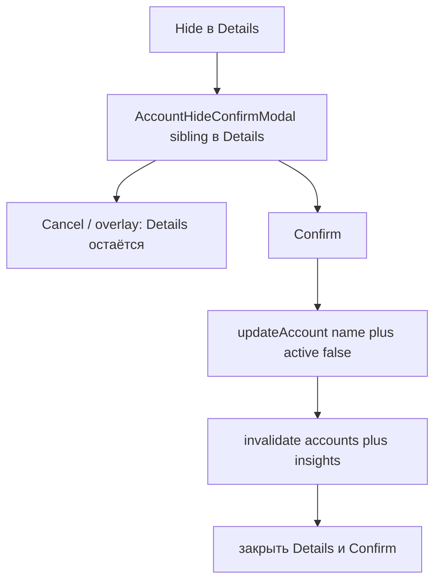

# US-022: скрывать счёт через active=false

**История:** [US-022](current-task/feature.json) — priority 22, `passes: false`. Figma нет (`designReference: []`). PRD §1.2.3.6 / §1.3.3.6 / §1.4.3.6: *Do you want to hide the {name} account? You can get the selected account back through the Firefly interface.* FR-5, Resolved Questions: вернуть счёт можно только в Firefly.

**Перед работой:** US-021 уже `"passes": true`. Create, Edit, Delete, поиск транзакций и пейджер не ломать.

**Вне скоупа:** запись транзакций и селекты From/To (US-024+), правка транзакций (US-029), чистка `monetta.accountAppearance.*` / `monetta.accountOrder.*`, правки `src/api`, показ скрытых счетов в Monetta.

## Контекст

Hide в [`AccountDetailsBody.tsx`](src/modules/budget/components/AccountDetailsModal/AccountDetailsBody/AccountDetailsBody.tsx) — `Button variant="default"` **без** `onClick`. Delete уже живёт **внутри Details**: `useDisclosure` + sibling [`AccountDeleteConfirmModal`](src/modules/budget/components/AccountDeleteConfirmModal/AccountDeleteConfirmModal.tsx). Review US-021: yes/no-диалоги принадлежат экрану, где уже есть счёт; **не** заводить сессию на Budget и **не** плодить хук.

Скрытые счета уже отсекаются в [`mapFireflyAccount.ts`](src/modules/budget/helpers/account/mapFireflyAccount.ts) (`active === false` → `null`). После invalidate список Budget и будущие селекты (тот же `useBudgetAccounts`) не увидят счёт. Preference порядка чистить не нужно: `sortAccountsByOrder` пропускает отсутствующие id.

SDK: `updateAccount` — **PUT** `/v1/accounts/{id}` ([`sdk.gen.ts`](src/api/sdk.gen.ts)), не PATCH. В типах [`AccountUpdate`](src/api/types.gen.ts) поле `name` обязательное, `active` опциональное. Тело: `{ name, active: false }` — текущее имя счёта + флаг. `throwOnError` не включать.

**Не** вызывать [`updateBudgetAccount.ts`](src/modules/budget/helpers/account/updateBudgetAccount.ts): он пишет appearance, для Current шлёт `opening_balance` и ждёт форму Edit.

## Шаги

### 1. Helper `hideBudgetAccount` + тесты

Новый [`src/modules/budget/helpers/account/hideBudgetAccount.ts`](src/modules/budget/helpers/account/hideBudgetAccount.ts) по образцу [`deleteBudgetAccount.ts`](src/modules/budget/helpers/account/deleteBudgetAccount.ts):

1. `updateAccount({ path: { id }, body: { name, active: false } })`
2. throw / не-ok → `{ ok: false }`
3. `response.ok` → `{ ok: true }` (PUT 200 с телом; не копировать проверку «нет `data`» из Create/Edit и не требовать 204)
4. **Не** писать appearance и order

Результат — `{ ok: true } | { ok: false }` в [`src/modules/budget/types/hideBudgetAccount.ts`](src/modules/budget/types/hideBudgetAccount.ts). Без `reason` / `FAILED` / `switch`. Не переиспользовать `updateBudgetAccount` и не расширять `toAccountUpdateBody` веткой hide.

Тесты в [`src/modules/budget/helpers/account/tests/hideBudgetAccount.test.ts`](src/modules/budget/helpers/account/tests/hideBudgetAccount.test.ts): мок `updateAccount` из `@/api/sdk.gen.ts`. Кейсы: 200 → ok и тело `{ name, active: false }`; 404/сеть → failed; `updatePreference` не вызывается. Фикстуру 200 уже даёт `createAccountSingleResult` в [`testHelpers.ts`](src/modules/budget/helpers/account/tests/testHelpers.ts).

### 2. i18n и модалка подтверждения

В [`src/i18n/en.ts`](src/i18n/en.ts) под `budget.accountDetails`:

- `hideConfirm`: `Do you want to hide the {{name}} account? You can get the selected account back through the Firefly interface.`
- `hideFailed`: `Could not hide the account`

Cancel — `budget.createAccount.cancel`. Hide — уже есть `budget.accountDetails.hide`. Интерполяция `{{name}}`, без `Trans`.

Новый [`AccountHideConfirmModal`](src/modules/budget/components/AccountHideConfirmModal/AccountHideConfirmModal.tsx) + CSS module рядом (как у Delete, не общий confirm-компонент):

- `Modal` `centered`, `stackId='account-hide-confirm'`
- текст, Cancel, кнопка Hide (`variant="default"`, `loading`) — не красная: действие обратимо в Firefly
- overlay / Escape / Cancel закрывают **только** confirm; Details не закрывать
- ошибка API — текст под кнопками, модалка остаётся
- submit/error в самой модалке; хука нет
- успех: `invalidateQueries` префиксов `BUDGET_ACCOUNTS_QUERY_KEY` и `BUDGET_INSIGHTS_QUERY_KEY` (Balance в баре из Current), затем `onSuccess`. Транзакции счёта **не** инвалидировать — Details закрывается

### 3. Провод Hide в Details

[`AccountDetailsModal.tsx`](src/modules/budget/components/AccountDetailsModal/AccountDetailsModal.tsx): второй `useDisclosure` рядом с delete. `handleClose` закрывает оба confirm. Sibling `AccountHideConfirmModal` с `opened={opened && hideOpened}`, `onSuccess={handleClose}`.

[`AccountDetailsBody.tsx`](src/modules/budget/components/AccountDetailsModal/AccountDetailsBody/AccountDetailsBody.tsx): проп `onHide`, повесить на кнопку Hide.

[`Budget.tsx`](src/modules/budget/Budget.tsx) и [`budgetSession.ts`](src/modules/budget/types/budgetSession.ts) **не** трогать. Стек по-прежнему `details.opened || edit.account`. Delete не менять.

Пока hide-confirm открыт, нижняя Details не должна закрываться снаружи (как Delete). Не вводить `locked` / `zIndex`.

## Верификация

1. **Тесты:** `npm test`
2. **Typecheck:** `npx tsc -b --pretty false` (отдельного npm-скрипта нет; `build` = `tsc -b && vite build`)
3. **Lint:** `npm run lint`
4. **Браузер** (cursor-ide-browser): Vite **5175** (`strictPort`), `HashRouter` `/#/monetta/login` → `/#/monetta/budget`
   - открыть карточку Income / Current / Expense (и Debt)
   - Hide → текст с именем счёта и фразой про Firefly
   - Cancel и клик по overlay: Details остаётся, карточка на месте
   - Confirm: модалки закрываются, карточки нет в блоке; Balance в parameters bar обновляется, если скрыли Current
   - Delete по-прежнему удаляет с подтверждением
   - ошибка API (если получится): Details/confirm не исчезают, счёт на месте
   - мобилка и десктоп (пейджер: клик по видимой карточке, не по `inert` слайду)

После реализации: `passes: true` у US-022 в [`current-task/feature.json`](current-task/feature.json), append в [`current-task/progress.txt`](current-task/progress.txt). Не коммитить.
