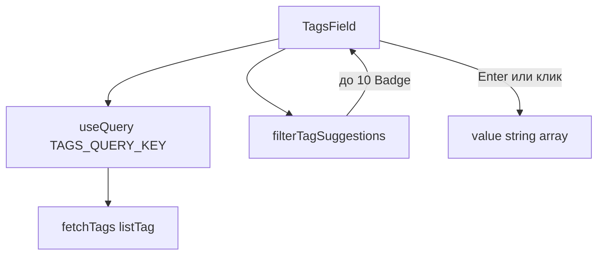

# US-023: общее поле тегов с подсказками

**История:** [US-023](current-task/feature.json) — priority 23, `passes: false`. Figma нет (`designReference: []`). PRD §1.5.1.1.7–8 / §1.5.2.1.7–8 / §1.5.3.1.7–8 / §1.6.4.7–8: текстовое поле поиска/создания + до 10 бейджей существующих тегов, отфильтрованных по полю.

**Перед работой:** US-022 уже `"passes": true` — не трогать Hide/Delete/Details, кроме регрессии в браузере.

**Вне скоупа:** RecordIncome/Expense/Transfer (US-024–026), `storeTransaction`, `storeTag`, drag-and-drop, Edit transaction (US-029), History/Analytics-фильтр «один тег» (это Select, не это поле), правки [`src/api`](src/api).

## Контекст

Сейчас общего UI тегов нет. В [`src/components`](src/components) только chrome (`AppLayout`, `RequireAuth`, Query persist). Транзакционные модалки ещё не существуют, поэтому поле живёт в `src/components` с контролируемым API `value` / `onChange`, а US-024 вставит его в форму.

Каталог тегов Firefly: `listTag` (`/v1/tags`, JSON:API-страницы). Не `getTagAc`: автокомплит не страницы, дергается на каждый ввод и плохо ложится на persist (FR-12). `storeTag` в этой истории не вызывать: Firefly создаёт тег при `storeTransaction` (US-024). Enter только добавляет строку в выбранные.

Vitest: `*.test.ts`, `environment: 'node'`, компонентных тестов нет. Роутер — `HashRouter`: `/#/monetta/settings`. Vite **5175**.

## Шаги

### 1. Хелперы каталога и фильтра

Новая папка [`src/helpers/tags/`](src/helpers/tags/) по образцу [`src/helpers/currency/`](src/helpers/currency/):

- [`constants.ts`](src/helpers/currency/constants.ts): `TAGS_QUERY_KEY` = `['tags', 'list']`, `TAGS_PAGE_LIMIT` = 50 (отдельная константа, не переиспользовать чужой limit по имени), `TAGS_MISSING_ERROR`, `TAG_SUGGESTIONS_LIMIT` = 10.
- `fetchTags.ts`: `collectFireflyPages` + `listTag({ query: { page, limit: TAGS_PAGE_LIMIT } })`. Маппить `attributes.tag`, пропускать пустые после trim, уникальность по lowercase (первое вхождение). Результат — `string[]`. `src/api` не править.
- `filterTagSuggestions(tags, query, selected, limit = TAG_SUGGESTIONS_LIMIT)`: trim + case-insensitive `includes`; пустой/пробельный query = без текстового фильтра; исключить уже выбранные (case-insensitive); обрезать до 10; порядок как в каталоге Firefly.
- `commitTag(query, selected, catalog)`: trim; пустое → без изменений; уже выбранное (case-insensitive) → без изменений; если есть в каталоге — взять канонический регистр Firefly; иначе — введённая строка. Возвращает новый массив выбранных.

Тесты в `src/helpers/tags/tests/` (`testHelpers.ts` для SDK-фикстур `listTag`, не `helpers.ts`): мок `@/api/sdk.gen.ts` как в [`fetchCurrencies.test.ts`](src/helpers/currency/tests/fetchCurrencies.test.ts). Покрыть: page limit, skip empty, missing `data` throws, фильтр/лимит/исключение selected, commit с каноническим регистром и no-op на дубликат.

### 2. Компонент `TagsField`

[`src/components/TagsField/`](src/components/TagsField/) (`TagsField.tsx` + `TagsField.module.css`) — общий UI, не budget-модуль.

Контролируемый:

- `value: string[]`
- `onChange: (tags: string[]) => void`
- `enabled?: boolean` (дефолт `true`) — чтобы US-024 мог не качать каталог, пока модалка закрыта

Внутри: `useQuery({ queryKey: TAGS_QUERY_KEY, queryFn: fetchTags, enabled })`. Без `placeholderData`. Persist уже на авторизованном дереве.

Разметка (Mantine 9, без выпадающего Combobox/TagsInput-dropdown — в PRD подсказки это бейджи):

- `PillsInput` + `Pill.Group`: выбранные теги как `Pill` с `withRemoveButton`
- `PillsInput.Field` — поиск/создание; локальный query state
- Enter: `preventDefault` (не сабмитить будущую форму транзакции), `commitTag`, очистить query
- Под полем — до 10 `Badge` (или кнопок-бейджей) из `filterTagSuggestions`. Клик добавляет тег и очищает query. Пустой каталог / нет совпадений — ряд пустой, поле всё равно создаёт новый тег
- Запятая не сплиттит: в имени тега Firefly бывают пробелы и запятые

Стили только в CSS module рядом. `react-hooks/static-components`: не рендерить динамический `<Icon />`.

i18n в [`src/i18n/en.ts`](src/i18n/en.ts) на корне (поле общее, не `budget.*`):

- `tags.label` = `Tags`
- `tags.placeholder` = `Search or create a tag`
- `tags.remove` = `Remove {{name}}`
- `tags.suggestions` — aria у ряда подсказок

### 3. Временный хост на Settings

Транзакционных модалок нет, а история требует проверки в браузере. Как Add в US-015: временный вход, не отдельный роут.

В [`src/modules/settings/Settings.tsx`](src/modules/settings/Settings.tsx) (уже внутри `QueryPersistenceProvider`): локальный `useState<string[]>([])` и один `TagsField`. CSS module рядом, если нужна колонка. Комментарий: US-024 снимает хост и вставляет поле в `RecordIncomeModal`. US-039 (Log out) этот хост не должен застать.

[`AppRouter.tsx`](src/router/AppRouter.tsx) и [`src/constants/router.ts`](src/constants/router.ts) не менять. Budget, Details, Create/Edit account — без изменений.

## Проверка

1. **`npm test`** — тесты `src/helpers/tags/tests/` и остальные зелёные.
2. **`npx tsc -b --pretty false`**
3. **`npm run lint`**
4. **Браузер** (cursor-ide-browser), Vite **5175**, `/#/monetta/login` → вкладка Settings `/#/monetta/settings`.

Чеклист в браузере:

- Поле Tags: ввод, Enter создаёт тег (pill), повтор того же имени не дублирует
- Под полем до 10 бейджей из Firefly; ввод фильтрует; выбранные пропадают из подсказок
- Клик по бейджу добавляет pill и очищает ввод; Remove на pill убирает тег
- Enter в поле не уводит со Settings и не ломает страницу
- Budget / Details / Create account без регрессии; Record income ещё нет
- Повторный заход на Settings: подсказки сразу из кеша Query, затем refetch (если есть PAT)

Готово, когда поле ищет, создаёт локально и показывает ≤10 бейджей Firefly, typecheck зелёный, `"passes": true` у US-023.
