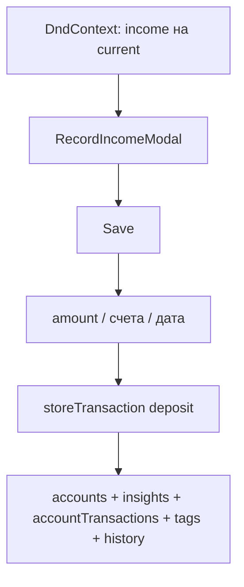

# US-024: записать доход перетаскиванием income на current

**История:** [US-024](current-task/feature.json) — priority 24, сейчас единственная следующая с `passes: false`. Figma нет (`designReference: []`). PRD §1.5.1 / §1.5.1.1 (поля 1.5.1.1.1–10). FR-6, FR-7.

**Перед работой:** US-023 уже `passes: true`. Хост `TagsField` на History/Settings снят — поле вставляем в `RecordIncomeModal`. Hide/Delete/Details/Create/Edit account не ломать.

**Вне скоупа:** UI RecordExpense / RecordTransfer (US-025–026) и sortable Edit (US-027–028). Общие хелперы дропа, store и инвалидации закладываем здесь — следующие истории импортируют их, не копируют. Страница History (US-030), `storeTag`, правки [`src/api`](src/api) — нет.

## Контекст

Готово:

- [`TagsField`](src/components/TagsField/TagsField.tsx) — `value` / `onChange`; каталог `TAGS_QUERY_KEY`; `storeTag` не вызывать (Firefly создаёт тег на `storeTransaction`)
- [`defaultTransactionDate`](src/modules/budget/helpers/month/budgetMonth.ts) — сегодня, если месяц Budget текущий, иначе 1-е число выбранного месяца
- Скрытые счета уже отфильтрованы в `useBudgetAccounts` (`active=false` не попадают в селекты)
- `storeTransaction` → `POST /v1/transactions`. Доход — Firefly-тип **`deposit`**: `source_id` = income (revenue), `destination_id` = current (asset), `amount` строка, `currency_code` валюты **current**, `tags?: string[]`. US-025 будет `withdrawal`, US-026 — `transfer`; маппер и оркестратор общие, тип — аргумент.
- Инвалидация после мутаций счетов: префиксы [`BUDGET_ACCOUNTS_QUERY_KEY`](src/modules/budget/constants/queries.ts) и [`BUDGET_INSIGHTS_QUERY_KEY`](src/modules/budget/constants/queries.ts). Для транзакции ещё `ACCOUNT_TRANSACTIONS_QUERY_KEY`, `TAGS_QUERY_KEY` и заготовка History
- Модалки: Mantine 9 `centered`; форма `@mantine/form` `useForm`; сессия на [`Budget.tsx`](src/modules/budget/Budget.tsx), не внутри карточки. Create всегда смонтирован; Edit монтируется по сессии
- Карточки — `role="button"`, не `<button>` (иначе пейджер не свайпает: `closest('button')`). Клик открывает Details. Vite **5175**, HashRouter `/#/monetta/budget`
- `@dnd-kit/core` уже в зависимостях, в UI ещё не используется. Sortable — US-027, не эта история

Конфликт свайпа и драга: [`usePageSwipe`](src/modules/budget/hooks/usePageSwipe.ts) на pointerdown делает `setPointerCapture` на весь viewport — события не доходят до карточки. Свайп уже лочится на ось X после [`PAGE_SWIPE_AXIS_LOCK_PX`](src/modules/budget/constants/layout.ts) (8px); income→current — в основном вертикальный жест.

## Шаги

### 1. Свайп не должен воровать pointer у DnD

В [`usePageSwipe.ts`](src/modules/budget/hooks/usePageSwipe.ts): **не** `setPointerCapture` на pointerdown. Захватывать только когда ось уже `'x'`. Вертикальный жест остаётся на карточке. Добавить флаг `enabled` (дефолт `true`): при активном dnd-kit drag свайп выключен (US-027 потом переиспользует).

`PointerSensor` в `DndContext`: `activationConstraint: { distance: PAGE_SWIPE_AXIS_LOCK_PX }`. Короткий клик → Details. Горизонталь → пейджер. Вертикаль/диагональ к current → drag. Не подключать отдельный `TouchSensor` (двойные события). `autoScroll: false` — Budget не скроллится.

После drop клик по карточке не должен открыть Details (флаг «был drag», как `didSwipe` + `onClickCapture`).

### 2. Общий DnD: в UI этой истории только income → current

Один `DndContext` в [`Budget.tsx`](src/modules/budget/Budget.tsx) вокруг трёх блоков + `DragOverlay` (портал в `document.body`, чтобы карточка вышла из `transform` карусели). Это тот же контекст для US-025/026 — не заводить второй.

Таблица ролей в одном месте, например [`src/modules/budget/constants/accountDnd.ts`](src/modules/budget/constants/accountDnd.ts) + чтение через хелпер. `AccountItem` не знает про income/expense, только `draggable` / `droppable` из таблицы:

- Сейчас: INCOME drag, CURRENT drop, EXPENSE ни то ни другое
- US-025 в этой же таблице включит CURRENT drag и EXPENSE drop; UI карточки не копировать

Только **видимый** слайд интерактивен (prev/next с `inert` — оба флага `disabled`). Add не участвует. id = `account.id` (глобально уникален).

Чистый хелпер [`src/modules/budget/helpers/transactions/resolveRecordDrop.ts`](src/modules/budget/helpers/transactions/resolveRecordDrop.ts): из `active`/`over` вернуть `{ kind, source, destination } | null`.

- income → current → `kind: 'income'`
- current → expense/debt → `kind: 'expense'` (классификация уже здесь; Budget в US-024 **не** открывает модалку)
- current → current → `kind: 'transfer'` (то же)
- остальное → `null`

`onDragEnd` в Budget: `switch` только по `'income'` → RecordIncomeModal. Ветки expense/transfer появятся в US-025/026 и будут импортировать этот же хелпер.

`AccountItem`: `useDraggable` / `useDroppable` с `disabled` из таблицы и `interactive` (проп с текущего слайда). Проп протащить Budget → Block → Pager → Viewport `gridForPage` → Grid → Item; не ветвить пейджер по `AccountType`. Overlay — та же карточка, `onSelectAccount` no-op. Подсветка `isOver` в CSS module карточки.

Сессия как у Details: `{ opened, source, destination, id }` в [`budgetSession.ts`](src/modules/budget/types/budgetSession.ts). `onDragEnd` открывает модалку и увеличивает `id` (remount формы). Тип сессии заложить так, чтобы US-025 добавил соседнюю (expense), а не переписывал Discriminant.

### 3. `RecordIncomeModal` + форма

Новая папка [`src/modules/budget/components/RecordIncomeModal/`](src/modules/budget/components/RecordIncomeModal/) (`tsx` + `module.css`). Одна модалка на Budget, не внутри сетки. Монтировать, пока `opened` или есть snapshot source/destination (чтобы закрытие анимировалось). `Modal.Stack` не нужен (пикера нет).

Поля (PRD §1.5.1.1):

- Income account — `Select` всех income; дефолт source drag
- Current account — `Select` всех current; дефолт destination drop
- Amount — `NumberInput` `hideControls`, обязательное, **валюта выбранного current**
- Currency — текст только чтение рядом (код выбранного current); при смене Current в селекте обновлять
- Date — `DatePickerInput` (`@mantine/dates`, строки `YYYY-MM-DD` как MonthPicker); дефолт `defaultTransactionDate({ month, today: todayIso() })`; обязательное. `maxDate={todayIso()}`: будущие дни выбрать нельзя, только до сегодня. Тот же `maxDate` потом у expense/transfer — не копировать другую дату «сегодня» в модалке
- Description — текст, необязательное; в body как ввёл пользователь (без `trim`). Пустое поле → `''`
- Tags — существующий `TagsField`; вернуть опциональный `enabled` (дефолт `true`), с модалки `enabled={opened}`, чтобы закрытая модалка не держала лишний fetch
- Cancel и клик по оверлею / Escape — закрыть без `storeTransaction`

Пустой/нечисловой/`<= 0` amount блокирует submit (как пустое имя в Create). Счета и дата обязательны.

i18n в [`src/i18n/en.ts`](src/i18n/en.ts), ключи `budget.recordIncome.*` (title, лейблы, `errors.amountRequired`, `errors.saveFailed`). Cancel/Save можно переиспользовать `budget.createAccount.cancel` / `save`. Теги остаются `tags.*`. Общие куски формы (amount + read-only currency, date с `maxDate`, description, tags) — маленький shared-блок в `src/modules/budget/components/`, чтобы RecordExpense не дублировал разметку. Селекты счетов остаются в RecordIncomeModal: у expense другой набор.

Хук `useRecordIncomeForm` по образцу [`useCreateAccountForm`](src/modules/budget/hooks/useCreateAccountForm.ts). Списки счетов — пропсы из кеша Budget, не второй fetch. Валидацию amount (`<= 0` / пусто) вынести в общий хелпер рядом с транзакциями — US-025 возьмёт его же.

SDK требует `description: string`: в UI поле необязательное; в body — значение поля как есть, пустое → `''`. Не `trim`. Если живой Firefly ответит 422 на пустое описание — в маппере fallback на имя income-счёта, поле не делать required.

### 4. Save → `storeTransaction` + инвалидация

Чистые хелперы в `src/modules/budget/helpers/transactions/` — **общие** для deposit / withdrawal / transfer, не `*Deposit`-only имена:

- `toTransactionStoreBody({ type, sourceId, destinationId, amount, currencyCode, date, description, tags })` → `TransactionStoreWritable`: один split. `type` из `FIREFLY_TRANSACTION_TYPE` (`DEPOSIT` сейчас; `WITHDRAWAL` / `TRANSFER` константы сразу, чтобы US-025 не плодил второй маппер). `amount` строкой, `date` как `${yyyy-mm-dd}T12:00:00` (полдень, календарный день не уезжает по TZ; dayjs только в хелпере, не в React). `description` как есть. Пустой `tags` — не слать или слать как есть, зафиксировать в тесте
- `createBudgetTransaction(body)`: `storeTransaction({ body })`, `throwOnError` false; успех — `response.ok` и `result.data?.data?.id`; иначе `{ ok: false }`. Результат `{ ok: true } | { ok: false }` без лишнего `reason`, как delete/hide
- `invalidateTransactionQueries(queryClient)`: один вызов со списком префиксов ниже. RecordIncome и потом RecordExpense вызывают его, не копируют `invalidateQueries`

Константы в [`constants/transactions.ts`](src/modules/budget/constants/transactions.ts): `FIREFLY_TRANSACTION_TYPE.DEPOSIT | WITHDRAWAL | TRANSFER`. В этой истории в store уходит только `DEPOSIT`.

После успеха инвалидировать префиксы:

- `BUDGET_ACCOUNTS_QUERY_KEY` — балансы карточек
- `BUDGET_INSIGHTS_QUERY_KEY` — Income/Expenses в parameters bar
- `ACCOUNT_TRANSACTIONS_QUERY_KEY` — списки в Details
- `TAGS_QUERY_KEY` — новые теги из deposit
- `HISTORY_TRANSACTIONS_QUERY_KEY` = `['history', 'transactions']` — новый файл [`src/modules/history/constants/queries.ts`](src/modules/history/constants/queries.ts). Саму страницу History не собирать; `invalidateQueries` по несуществующему ключу — no-op, контракт для US-030

Не вызывать `refetchQueries` поверх invalidate. Модалку закрывать только при `ok`.

### 5. Тесты хелперов

Vitest `*.test.ts`, `environment: 'node'`, без компонентных тестов. Мок `@/api/sdk.gen.ts` как в [`createBudgetAccount.test.ts`](src/modules/budget/helpers/account/tests/createBudgetAccount.test.ts). Фикстуры — в `helpers/transactions/tests/testHelpers.ts` (уже есть).

Покрыть: body deposit (type, ids, amount-string, currency current, date noon, tags, description как есть включая пробелы); `resolveRecordDrop` — income→current, current→expense, current→current, мусор → null; store успех/нет id/throw; валидация amount.

## Проверка

1. `npm test`
2. `npx tsc -b --pretty false`
3. `npm run lint`
4. Браузер (cursor-ide-browser): Vite 5175, `/#/monetta/budget`. Нужен живой PAT. Прогнать поток, не один скриншот. Mobile (`<961px`) и desktop.

Чеклист:

- Клик по карточке по-прежнему открывает Details; Add / Create / Edit / Hide / Delete без регрессии
- Горизонтальный свайп Income/Current/Expense листает страницы, точки/стрелки живые
- Drag income на current открывает Record income; дефолты source/dest совпадают с жестом; селекты без скрытых
- Amount обязателен; Currency read-only следует за выбранным current; Date = today на текущем месяце Budget и 1-е число на прошлом; в календаре дни после сегодня выключены
- Tags: Enter и бейджи, Enter не сабмитит форму
- Cancel и оверлей не пишут транзакцию
- Save: deposit в Firefly, балансы карточек и Income в parameters bar обновляются без перезагрузки
- Drag current→expense / current→current / income→income модалку не открывают (`resolveRecordDrop` уже может вернуть kind — Budget его игнорирует)
- Карточка на inert-слайде не принимает drop
- History остаётся заглушкой; Settings без TagsField

Готово, когда доход создаётся жестом income→current, typecheck зелёный, `"passes": true` у US-024. Записать итог в [`current-task/progress.txt`](current-task/progress.txt) и [`current-task/learnings.txt`](current-task/learnings.txt).
